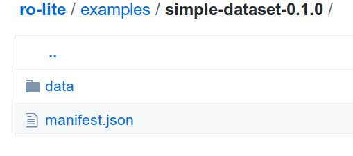
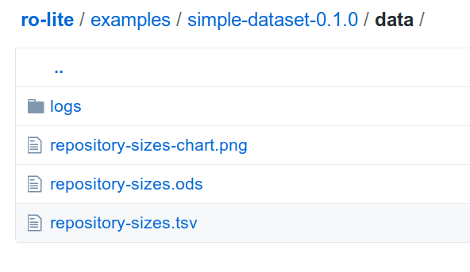

<!--
   Copyright 2019 RO Crate contributors 
   <https://github.com/ResearchObject/ro-crate/graphs/contributors>

   Licensed under the Apache License, Version 2.0 (the "License");
   you may not use this file except in compliance with the License.
   You may obtain a copy of the License at

       http://www.apache.org/licenses/LICENSE-2.0

   Unless required by applicable law or agreed to in writing, software
   distributed under the License is distributed on an "AS IS" BASIS,
   WITHOUT WARRANTIES OR CONDITIONS OF ANY KIND, either express or implied.
   See the License for the specific language governing permissions and
   limitations under the License.
-->

# ROLite 0.1.0

This first draft of -ROLite-[RO-Crate](../) is more of an example playground to initiate discussion.

This example is based on [DataCrate](https://github.com/UTS-eResearch/datacrate) and [BioSchemas](http://bioschemas.org/specifications/), bringing in Research Object vocabularies where appropriate.

1. Table of Contents
{:toc}

## Explaining by example: a simple dataset

[simple-dataset-0.1.0](https://github.com/ResearchObject/ro-lite/tree/master/examples/simple-dataset-0.1.0) shows an example of a fairly minimal dataset, which can live in GitHub, be distributed as a ZIP archive, posted to Zenodo etc.



The files of the dataset are under [`data/`](https://github.com/ResearchObject/ro-lite/tree/master/examples/simple-dataset-0.1.0/data), which mean this folder structure could later be upgraded to be a BagIt archive ([RFC8493](https://www.rfc-editor.org/rfc/rfc8493.txt)).



Here are our files described in this ROLite example:

* `repository-sizes.tsv` and `repository-sizes.ods` - our main dataset in raw tab-separated format and organized as a spreadsheet
* `repository-sizes-chart.png` - a chart from the spreadsheet
* `logs/` - various log files

To describe these resources and their relations, ROLite has a single file [manifest.jsonld](https://github.com/ResearchObject/ro-lite/blob/master/examples/simple-dataset-0.1.0/manifest.jsonld)

The JSON file is split into a couple of logical parts that in total make out the schema.org description in JSON-LD of both the dataset and the Research Object.

### Preamble

```jsonld
{
    "@context": ["http://schema.org", "https://w3id.org/bundle/context"],
    "@type": ["ro:ResearchObject", "Dataset"],   
    "@id": ".",
    "identifier": "976287d8886dbc477272976658598b1764493a3e",
}
```

The `@context` means we are using JSON keys from both `schema.org` and Research Object. The default vocabulary is schema.org, but the RO vocabularies can override (shown using the `ro:` etc below)

**TODO: Alternative bundle-independent context for research objects**

The `@type` shows we are dealing with a Research Object, in particular one that is also a <http://schema.org/Dataset>.

The `@id` shows that the Research Object is the current directory. Note: other RO serializations have `manifest.json` in subdirectories like `.ro` or `metadata/`; here it is in the root folder to avoid relative climbs like `../data/`.

While the current directory is a good root, it is also a relative identifier, meaning that any copy or publication of this RO will effectively have a different `@id`. This is on purpose, in case they get edited. However it is always good practice to assign a more durable and unique identifier (see [Identifiers for the 21st century](https://doi.org/10.1371/journal.pbio.2001414)), which can be provided using the <http://schema.org/identifier> property. The value should ideally be a URI (e.g. `https://doi.org/10.17632/6wtpgr3kbj.1`), but in this example use a local (but unique) git commit ID.

## Dataset description

```jsonld
    "name": "Dataset of repository sizes in CWL Viewer",
    "description": "This is a simple dataset showing the size in bytes of the repositories examined by https://view.commonwl.org/ sinze September 2018",
    "keywords": "CWL, repository, example",    
    "temporalCoverage": "2018-09/2019-01",
    "contentLocation": {
            "@id": "http://sws.geonames.org/9884115/",
            "name": "Kilburn Building, Manchester, UK"
    }
```

## File attributions

A key aspect of Research Objects is _attribution_. The manifest makes it possible to attribute different people for different files in the research object, but also for making the collection of the reserarch object:

```jsonld
{    
  "@type": ["ro:ResearchObject", "Dataset"],    
  "@id": ".",
  "creator": {
        "@type": "Person",
        "@id": "https://orcid.org/0000-0001-9842-9718",
        "name": "Stian Soiland-Reyes",
        "email": "soiland-reyes@manchester.ac.uk"
  }
}
```

Any attributes from [Person](http://schema.org/Person) may be provided, minimally `name`. Consider that [names across the world](https://www.w3.org/International/questions/qa-personal-names) varies significantly, don't assume anything about the order of parts of their name. Thus properties like [familyName](https://schema.org/familyName) or [givenName](https://schema.org/givenName) should only be listed if provided as such by the person.

As many people have the same name, and a person may have multiple email addresses (even multiple names!), attributions should also provide a [ORCID identifier](http://orcid.org/) using `@id` to disambiguate people when possible.

_Tip: Always providing a  `@id` on a `Person` avoids duplicating their other attributes on later mentions of the same person._

In ROLite, if a file does not list a `creator`, and is within the Research Object's folders, it's creator can reasonably be assumed to be the `creator` of the containing research object. However, where appropriate, the Research Object manifest allows overriding with more precise attribution per resource. For instance, if this chart was created by Alice:

```jsonld
{
            "@id": "data/repository-sizes-chart.png",
            "@type": ["ImageObject"],            
            "description": "Line chart of repository sizes. Exported from spreadsheet."
            "creator": {
                "@type": "Person",
                "name": "Alice W Land",
            }
}
```

### Multiple people

In some cases there are multiple people involved in making the creative work, even if they didn't physically save the file (e.g. collaborative editing). 

In this case it can be useful to distinguish their roles using [http://schema.org/author](http://schema.org/author) - for instance if Thomas only re-typed the file, which data where collected on paper by Baudoin:

```jsonld
{ 
  "@id": "data/repository-sizes.tsv"
  "creator": {
   "@type": "Person",
   "name": "Thomas"
  },
  "author": {
   "@type": "Person",
   "name": "Baudoin"
   }
}
```

Other contributors, (e.g. they fixed something in the spreadsheet) can be indicated with [contributor](http://schema.org/contributor).

All `creator`, `author` and `contributor` properties MAY be JSON lists `[]` to support multiple people - however as classical files are usually (last) saved by a single person it is expected that `creator` is a single object.

_Tip: The `creator` is expected to be present in the `author` or `contributor` list as they will have contributed to the creative work (the content of the file) rather than just its bytes. Exception: typists, converters, archivists. If neither `author` or `contributor` are provided, then the `creator` can be reasonably assumed to be the implied `author`._

Sometimes it is useful to indicate the software and software version used to create a file. This can be indicated as a [http://schema.org/SoftwareApplication](http://schema.org/SoftwareApplication) with the key `pav:createdWith` in conjunction with the `creator` of the person that used the software.

```jsonld
{
  "@id": "data/repository-sizes.ods"
  "creator": {
   "@type": "Person",
   "name": "Thomas"
  }
  "pav:createdWith": {
   "@type": "SoftwareApplication",
   "name": "Apache OpenOffice",
   "softwareVersion": "4.1.6",
   "url": "https://www.openoffice.org/"
  }
}
```

_Tip: If the file was created automatically without a person controlling it, then the `SoftwareApplication` would instead be the `creator`._

## Next step: Workflow research object

The example [workflow-0.1.0](https://github.com/ResearchObject/ro-lite/tree/master/examples/workflow-0.1.0) shows a more complex example of a Research Object containing a workflow.

In this example there is both `workflow/` `tools/` and `test/` - but no `data/` payload.

This example shows how RO Lite can be used with a non-trivial pre-existing directory structure. In particular the [workflow/](https://github.com/ResearchObject/ro-lite/tree/master/examples/workflow-0.1.0/workflow) folder is actually a KNIME workspace folder that contain a [KNIME workflow](https://www.knime.com/) and its contained input and output data in the internal format used by KNIME. 

The Research Object [manifest.jsonld](https://github.com/ResearchObject/ro-lite/blob/master/examples/workflow-0.1.0/manifest.jsonld#L39) only highlight a couple of these files:

```json
"aggregates": [
        {
            "@id": "workflow/workflow.knime",
            "@type": ["SoftwareSourceCode", "wfdesc:Workflow"],
            "name": "RetroPath 2.0 Knime workflow",
            "description": "KNIME implementation of RetroPath2.0 workflow",
            "creator": {
                    "@type": "Person",
                    "name": "Thomas Duigou",
                    "email": "thomas.duigou@inra.fr"
            },
            "programmingLanguage": {
                "name": "KNIME Analytics Platform",
                "url": "https://www.knime.com/knime-software/knime-analytics-platform",
                "version": "3.6"
            },
            "url": "https://www.myexperiment.org/workflows/4987"
        }
# ...
```

As before, the [http://schema.org/creator](http://schema.org/creator) indicates who created the KNIME workflow file. 


The [workflow/workflow.knime](https://github.com/ResearchObject/ro-lite/blob/master/examples/workflow-0.1.0/workflow/workflow.knime) file is in KNIME's internal XML format, indicated here as both as a Research Object `Workflow` as well as a [http://schema.org/SoftwareSourceCode](http://schema.org/SoftwareSourceCode).

_Tip: To enable schema.org parsing, e.g. by Google's [Structured Data Testing tool](https://search.google.com/structured-data/testing-tool/u/0/), a corresponding schema.org type must be provided. http://schema.org/CreativeWork or http://schema.org/Thing are useful fallbacks._

Here [http://schema.org/programmingLanguage](http://schema.org/programmingLanguage) is used informally to indicate the workflow system used. Providing an identifier with `@id` mau enable further programmatic understanding of the execution environment.

In addition the `workflow/` folder, the KNIME workspace that captures the internal workflow state, is listed as an `ExampleRun`. As this is hard to call this programmatic state a _creative work_ it is just indicated as a https://schema.org/Thing as a fallback, here enabling [http://schema.org/description](http://schema.org/description)

```json
        {
            "@id": "workflow/",
            "@type": ["Thing", "roterms:ExampleRun"],
            "description": "KNIME workspace after executing RetroPath2.0 workflow"
        }
```

