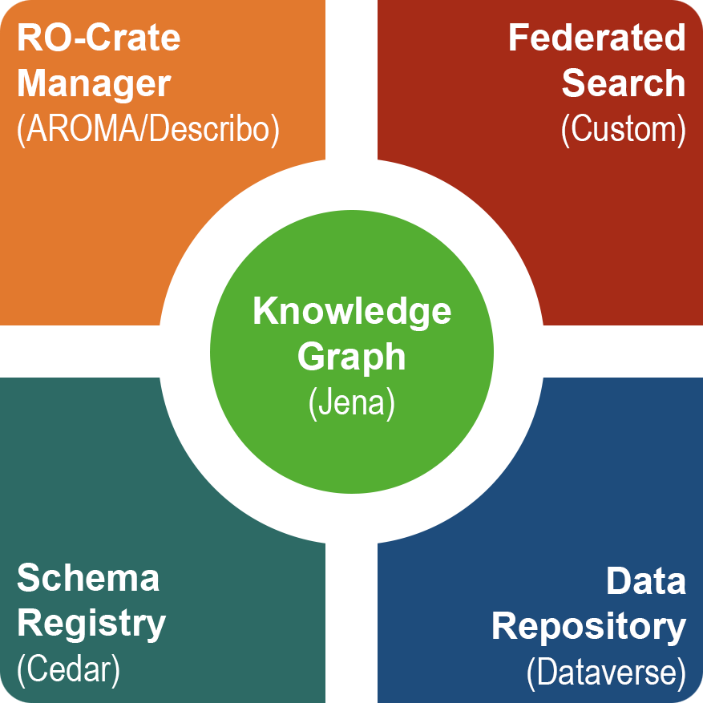

The [ARP Adatrepozitórium Platform](http://researchdata.hu/en) (Data Repository Platform) is a national initiative of the
[Hungarian Research Network (HUN-REN)](https://hun-ren.hu/home), led by [SZTAKI (HUN-REN Institute for Computer
Science and Control)](https://sztaki.hun-ren.hu/en), to build a multidisciplinary repository system capable of hosting the
scientific data output of the Hungarian research community. ARP is a federated service that
collects data from its own Dataverse repository as well as other institutional data repositories in
Hungary to establish a European Open Science Cloud (EOSC)-compliant research
infrastructure.

<figcaption style="text-align:center; margin-bottom: 10px;">ARP core services</figcaption>

ARP is built around [Harvard's Dataverse](https://dataverse.org/). However, we found that to make ARP truly multidisciplinary,
research communities need the ability to easily author and publish metadata schemas relevant
to their scientific fields. While Dataverse provides metadata schemas via its metadata blocks
and TSV input format, creating, updating, and curating these are challenging for researchers
who are not metadata experts. To address this, we integrated [Stanford's CEDAR](https://metadatacenter.org/) as the schema authoring
registry tool for ARP. With this integration, researchers can now easily create complex schemas
using CEDAR’s drag-and-drop template editor and export and synchronize these with
Dataverse, effectively enabling direct metadatablock authoring within Dataverse.

Another limitation of Dataverse is that it provides only minimal metadata for the files within a
dataset. To overcome this and enhance dataset accessibility, we introduced the Research
Object Crate (RO-Crate) exchange format as a first-class object of ARP. We not only added
export and import functionality for RO-Crate but also developed a complete authoring tool,
[AROMA]({{baseurl}})
, based on the RO-Crate editor component of the [Describo](https://github.com/describo/crate-builder-component) project.
The use of RO-Crate and the integration of CEDAR schemas make it possible to associate
metadata not only with the root dataset but also with any files and subdirectories. Users can
define their own specific schemas in CEDAR, associate them with selected files and directories
of their dataset in AROMA, and use these schemas to describe their data in greater depth than
was previously possible in Dataverse.

In this video we demonstrate how Dataverse, CEDAR, and RO-Crate enhance the metadata workflow of the
Hungarian research community and how our achievements could be applied to the broader
Dataverse community.

  <iframe
    src="https://www.youtube.com/embed/o_ENdITtIQg?si=1_c4BTG-esD04Duc"
    title="YouTube video player"
    style="position: absolute; top: 0; left: 0; width: 100%; height: 100%;"
    frameborder="0"
    allow="accelerometer; autoplay; clipboard-write; encrypted-media; gyroscope; picture-in-picture; web-share"
    referrerpolicy="strict-origin-when-cross-origin"
    allowfullscreen>
  </iframe>

