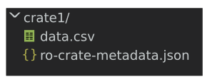

<!--
   Copyright 2019-2020 University of Technology Sydney
   Copyright 2019-2023 The University of Manchester UK 
   Copyright 2019-2023 RO-Crate contributors <https://github.com/ResearchObject/ro-crate/graphs/contributors>

   Licensed under the Apache License, Version 2.0 (the "License");
   you may not use this file except in compliance with the License.
   You may obtain a copy of the License at

       http://www.apache.org/licenses/LICENSE-2.0

   Unless required by applicable law or agreed to in writing, software
   distributed under the License is distributed on an "AS IS" BASIS,
   WITHOUT WARRANTIES OR CONDITIONS OF ANY KIND, either express or implied.
   See the License for the specific language governing permissions and
   limitations under the License.
-->

# Introduction

This document specifies a method, known as _RO-Crate_ (Research Object Crate), of aggregating and describing data for distribution, re-use, publishing, preservation and archiving. RO-Crates aggregate data into a Dataset, and may describe any resource including files, URI-addressable resources, or use other addressing schemes to locate digital or physical data. Describing resources includes technical metadata such as file sizes and types as well as contextual information including how and where datasets and files were created, how they were collated and collected, who was involved in the process, what equipment and software was used, who funded the work, how to cite it, and crucially, how it may be reused, and by whom.

The core of RO-Crate is a machine-readable linked-data document in JSON-LD format known as an **RO-Crate Metadata Document**. RO-Crate metadata documents can, to a large extent, be created and processed just like any other JSON: knowledge of JSON-LD is not needed, unless extending RO-Crate with additional concepts or combining RO-Crate with other Linked Data technologies.

This section introduces the general RO-Crate concepts through a running example, while the normative sections in the rest of the RO-Crate specification define in more detail these and other concepts using separate examples and recommendations.

## Walkthrough: An initial RO-Crate

In the simplest form, to describe some data on disk, a file named `ro-crate-metadata.json` is placed in a directory alongside a set of files or directories. This `ro-crate-metadata.json` file is known as the _RO-Crate Metadata Document_.

In the example below, a single file `data.csv` is placed with the _RO-Crate Metadata Document_ in a directory named `crate1`:

<figure>
  
  <figcaption>Figure 1: Any folder can be made into an RO-Crate by adding <code>ro-crate-metadata.json</code></figcaption>
</figure>

The presence of the `ro-crate-metadata.json` file means that `crate1` and its children can now be considered to be an **RO-Crate**.

### Running example

In this running example, the content of the _RO Crate Metadata Document_ is:


```json
{
  "@context": "https://w3id.org/ro/crate/1.2-DRAFT/context",
  "@graph": [
    {
      "@id": "ro-crate-metadata.json",
      "@type": "CreativeWork",
      "conformsTo": {"@id": "https://w3id.org/ro/crate/1.2-DRAFT"},
      "about": {"@id": "./"}
    },
    {
      "@id": "./",
      "@type": "Dataset",
      "name": "Example dataset for RO-Crate specification",
      "description": "Official rainfall readings for Katoomba, NSW 2022, Australia",
      "datePublished": "2022-12-01",
      "publisher": {"@id": "https://ror.org/04dkp1p98"},
      "license": {"@id": "http://spdx.org/licenses/CC0-1.0"},
      "hasPart": [
        {"@id": "data.csv"}
      ]
    },
    {
      "@id": "data.csv",
      "@type": "File",
      "name": "Rainfall data for Katoomba, NSW Australia February 2022",
      "encodingFormat": "text/csv",
      "license": {"@id": "https://creativecommons.org/licenses/by-nc-sa/3.0/au/"}
    },
    {
      "@id": "https://ror.org/04dkp1p98",
      "@type": "Organization",
      "name": "Bureau of Meteorology",
      "description": "Australian Government Bureau of Meteorology",
      "url": "http://www.bom.gov.au/"
    },
    {
      "@id": "https://creativecommons.org/licenses/by-nc-sa/3.0/au/",
      "@type": "CreativeWork",
      "name": "CC BY-NC-SA 3.0 AU",
      "description": "Creative Commons Attribution-NonCommercial-ShareAlike 3.0 Australia"
    }
  ]
}
```

### JSON-LD preamble

The preamble of `@context` and `@graph` are JSON-LD structures that help provide global identifiers to the JSON keys and types used in the rest of the _RO-Crate Metadata Document_. These will largely map to definitions in the [schema.org](http://schema.org/) vocabulary, which can be used by RO-Crate extensions to provide additional metadata beyond the RO-Crate specification. It is this feature of JSON-LD that helps make RO-Crate extensible for many different purposes -- this is explored further in the [appendix on JSON-LD](appendix/jsonld).

However, in the general case it should be sufficient to follow the RO-Crate JSON examples directly without deeper JSON-LD understanding. In short, an _RO-Crate Metadata Document_ contains a flat list of _entities_ as objects in the `@graph` array. These entities are cross-referenced using `@id` identifiers rather than being deeply nested.

### RO-Crate Metadata Descriptor 

The first JSON-LD _entity_ in our example above has the `@id` `ro-crate-metadata.json`:


```json
{
    "@id": "ro-crate-metadata.json",
    "@type": "CreativeWork",
    "conformsTo": {"@id": "https://w3id.org/ro/crate/1.2-DRAFT"},
    "about": {"@id": "./"}
}
```

This required entity, known as the _RO-Crate Metadata Descriptor_, helps this file self-identify as an _RO-Crate Metadata Document_, which is conforming to (`conformsTo`) the RO-Crate specification version 1.2-DRAFT. 

The descriptor also indicates via the `about` property which entity in the `@graph` array is the _RO-Crate Root_ dataset -- the starting point of this RO-Crate. 

### RO-Crate Root

We can visualise how the above entity references the **RO-Crate Root** as:

<figure>
  
  <figcaption>Figure 2: showing RO-Crate Metadata descriptor's <code>about</code> property pointing at the RO-Crate Root entity with matching <code>@id</code></figcaption>
</figure>

By convention, in RO-Crate the `@id` value of  `./` means that this document describes the directory of content in which the _RO-Crate Metadata Document_ is located, as in the example above. This reference from `ro-crate-metadata.json` is therefore marking the `crate1` directory as being the _RO-Crate Root_. The entity whose `@id` is the _RO-Crate Root_ is called the _Root Data Entity_.



### About cross-references

In an _RO-Crate Metadata Document_, entities are cross-referenced using `@id` reference objects, rather than using deeply nested JSON objects. In short, this _flattened JSON-LD_ style allows any entity to reference any other entity, and RO-Crate consumers to directly find all the descriptions of an entity within a single JSON object. So let's have a look at the _Root Data Entity_ `./`:


```json
{
    "@id": "./",
    "@type": "Dataset",
    "…": "…",
    "hasPart": [ {"@id": "data.csv"} ]
}
```

The _Root Data Entity_ always has `@type` `Dataset`, though it may have more than one type. It has several metadata properties that describe the RO-Crate as a whole, as a collection of resources. The section on the [Root Data Entity](root-data-entity) explores further the required and recommended properties of this entity.

### Data entities {#intro-data-entities}

A main type of resources collected are _data_ -- simplifying, we can consider data as any kind of file that can be opened in other programs. These are aggregated by the _Root Data Entity_ with the `hasPart` property. In this example we have an array with a single value, a reference to the entity describing the file `data.csv`. 



<figure id="figure2">
  
  <figcaption>Figure 3: RO-Crate Root entity referencing the data entity with <code>@id</code> identifier <code>data.csv</code></figcaption>
</figure>

If we now follow the `@id` reference for the corresponding _data entity_ JSON block, we see it has `@type` value of `File` and additional metadata such as `encodingFormat`. It is recommended that every entity has a human readable `name`, which as shown in this example, does not need to match the filename/identifier. The `encodingFormat` indicates the media file type so that consumers of the crate can open `data.csv` in an appropriate program.


```json
{
  "@id": "data.csv",
  "@type": "File",
  "name": "Rainfall data for Katoomba, NSW Australia February 2022",
  "encodingFormat": "text/csv",
  "license": { "@id": "https://creativecommons.org/licenses/by-nc-sa/3.0/au/" }
},
```

For more information on describing files and directories, including their recommended and required attributes, see the section on [data entities](data-entities).


### Contextual entities {#intro-contextual-entities}

Moving back to the RO-Crate _Root Data Entity_ (with `@id` `./`), the publisher of this Dataset should be indicated using the property `publisher` and using a URI to identify the publishing `Organization`, linking to what is known as a _Contextual Entity_ that provides some information about the Organization such as its name and web address.


```json
{
    "@id": "./",
    "@type": "Dataset",
    "publisher": {"@id": "https://ror.org/04dkp1p98"},
    "…": "…"
 }

{
   "@id": "https://ror.org/04dkp1p98",
   "@type": "Organization",
   "name": "Bureau of Meteorology",
   "description": "Australian Government Bureau of Meteorology",
   "url": "http://www.bom.gov.au/"
}
```

You may notice the subtle difference between a _data entity_ that is conceptually part of the RO-Crate and is file-like (containing bytes), while this _contextual entity_ is a representation of a real-life organization that can't be downloaded: following the URL, we would only get its _description_. The section on [contextual entities](contextual-entities) explores several of the entities that can be added to the RO-Crate to provide it with a **context**, for instance how to link to authors and their affiliations.  Simplifying slightly, a _data entity_ is referenced from `hasPart` in a `Dataset`, while a _contextual entity_ is referenced using any other defined property.

## HTML preview

An RO-Crate can be distributed on disk, in packaged format such as a zip file or disk image, or placed on a static website. In any of these cases, an RO-Crate should have an accompanying HTML version (`ro-crate-preview.html`) designed to be human-readable. The exact contents of the preview may vary but should correspond to the _RO-Crate Metadata Document_ content and link to the contained data entities. The preview may be generated automatically from the _RO-Crate Metadata Document_ (see [RO-Crate tools](../../tools)), or even by hand (equivalent to a README).

Below is a screenshot from the [preview of the running example](examples/rainfall-1.2.0/ro-crate-preview.html), which was generated using the [ro-crate-html](https://www.npmjs.com/package/ro-crate-html) package:

<figure>
  
  <figcaption>Figure 4: RO-Crate preview of the running example.</figcaption>
</figure>


## Overview of specification

The rest of this specification is structured as follows:

* [Terminology](terminology) defines terms such as _Entity_ used in this section and the rest of the specification. You may use this section as a quick-reference, but note that most of these are also covered in detail in separate sections.
* [RO-Crate Structure](structure) defines further how the `ro-crate-metadata.json` and data files can be organized within an _RO-Crate Root_ directory.
* [Metadata of the RO-Crate](metadata) explains the connection to Linked Data principles and how RO-Crate keys are mapped to global identifiers. This is mainly of interest for readers already familiar with JSON-LD or ontologies, or which want to expand RO-Crate metadata keys.
* [Root Data Entity](root-data-entity) defines the entities _RO-Crate Metadata Descriptor_ (`ro-crate-metadata.json`) and _Root Data Entity_ (`./`) including their required and recommended properties.
* [Data Entities](data-entities) explores further how to describe data, including files, directories and Web references. Metadata such as file formats help inform RO-Crate consumers on which tools may be able to process the data. 
* [Contextual Entities](contextual-entities) shows how to describe entities used to annotate other entities, adding `People` and `Organization` referenced from `author`, `publication`, `affiliation` etc. Metadata like licensing, funding, locations and subjects can be described using contextual entities.
* [The focus of an RO-Crate](crate-focus) describes how an RO-Crate can indicate the most important or central entities within it.
* [Provenance of Entities](provenance) explores how the history of making an entity can be added to the RO-Crate using a series of _actions_ -- this may include real-world activities and instruments, as well as software executions and modifications to the RO-Crate metadata itself. 
  * Subsection [Digital Library and Repository content](provenance#digital-library-and-repository-content) details how records in an existing repository (which may  reference files, but also physical objects) can be described and published using RO-Crate.
* [Workflows and Scripts](workflows) explains how computional software and code can be added to an RO-Crate, possibly as part of explaining provenance, but also for providing potential usage and further processing of the data. 
* [Profiles](profiles) formalises how a set of RO-Crates can indicate they are conforming to a specific _RO-Crate profile_, which may add additional requirements beyond this general RO-Crate specification. Profiles may add additional terms from `schema.org` and other vocabularies, or require a certain type of data entity used in a particular research domain.  Profiles can themselves be expressed as an RO-Crate, which is also explored in this section.
* [Appendixes](appendix) contain more technical references and suggestions for developers, e.g. for deciding on `@id` [in JSON-LD](appendix/jsonld#describing-entities-in-json-ld) or [extending RO-Crate terms](appendix/jsonld#extending-ro-crate). The appendix also explores how an RO-Crate can be [packaged with BagIt](appendix/implementation-notes#combining-with-other-packaging-schemes) or used as part of a repository.

Throughout the specification you will find references to the keys and types reused from `schema.org` through the JSON-LD context, for instance [Dataset], which define many more properties than the ones highlighted by sections like [Root Data Entity](root-data-entity). The intention is that the RO-Crate specification gives a common minimum of metadata, and that producers of RO-Crates can use additional `schema.org` types and properties as needed. When some patterns emerge from such extensions they can be formalized in a published [profile](profiles) to ensure they are also used consistently.


