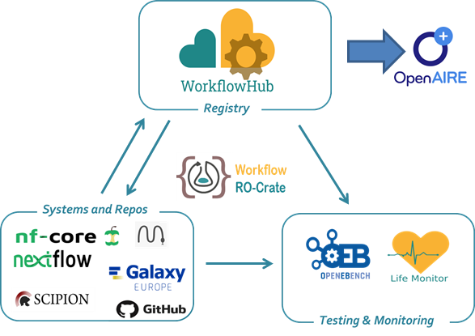

<!--
   Copyright 2019-2020 The University of Manchester and RO Crate contributors
   <https://github.com/ResearchObject/ro-crate/graphs/contributors>

   Licensed under the Apache License, Version 2.0 (the "License");
   you may not use this file except in compliance with the License.
   You may obtain a copy of the License at

       http://www.apache.org/licenses/LICENSE-2.0

   Unless required by applicable law or agreed to in writing, software
   distributed under the License is distributed on an "AS IS" BASIS,
   WITHOUT WARRANTIES OR CONDITIONS OF ANY KIND, either express or implied.
   See the License for the specific language governing permissions and
   limitations under the License.
-->

# Life Monitor

[Life Monitor](https://github.com/crs4/life_monitor) is a testing and monitoring service for computational workflows being developed as part of the [EOSC-Life](https://www.eosc-life.eu) project. It aims to facilitate the execution, monitoring and sharing of workflow tests over time, allowing to detect deviations from expected workflow operation and provide useful feedback to the workflow authors for maintaining and improving their work.

Life Monitor uses RO-Crate as an exchange format for the description of test suites associated with workflows. To this end, the Life Monitor team is developing [an extension to the Workflow RO-Crate specification](https://github.com/crs4/life_monitor/wiki/Workflow-Testing-RO-Crate) to support the inclusion of metadata related to the testing of computational workflows stored in the crate.

  

