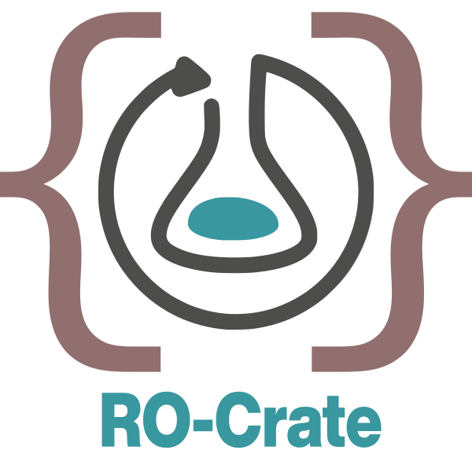
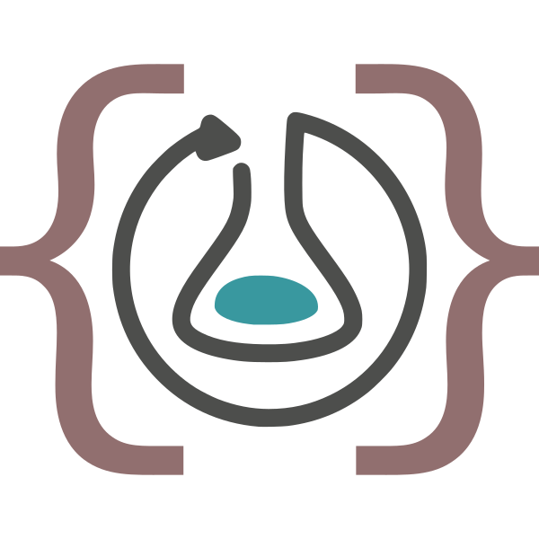
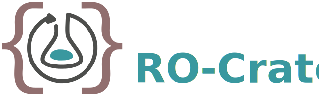

<!--
   Copyright 2019-2023 The University of Manchester and RO Crate contributors 
   <https://github.com/ResearchObject/ro-crate/graphs/contributors>

   Licensed under the Apache License, Version 2.0 (the "License");
   you may not use this file except in compliance with the License.
   You may obtain a copy of the License at

       http://www.apache.org/licenses/LICENSE-2.0

   Unless required by applicable law or agreed to in writing, software
   distributed under the License is distributed on an "AS IS" BASIS,
   WITHOUT WARRANTIES OR CONDITIONS OF ANY KIND, either express or implied.
   See the License for the specific language governing permissions and
   limitations under the License.   
-->

# RO-Crate Outreach and Publications 
{: .no_toc }

{: .tip } 
**Upcoming RO-Crate workshops and training events**:  
[_FAIR data and provenance with RO-Crate and Galaxy_](https://gallantries.github.io/video-library/modules/ro-crate) module at **[Galaxy Smörgåsbord 2023](https://gallantries.github.io/video-library/events/smorgasbord3/)**, 2023-05-22 / --26, virtual/async.  
[_Building lightweight FAIR data packages with Bioschemas and RO-Crate_](https://docs.google.com/document/d/1Vh9mUBWvNEsvC5YZRITtZxsyE6Wr18rJUgp9KweJFNg) workshop at **[ELIXIR All Hands 2023](https://elixir-europe.org/events/elixir-all-hands-2023)**, 2023-06-05/--08, Dublin, Ireland + hybrid (ELIXIR members only).  
[_Data exchange with RO-Crates and Knowledge Graphs_](https://www.zbmed.de/vernetzen/veranstaltungen/open-science-festival/open-standards-for-data-management) workshop at **[Open Science Festival 2023](https://www.zbmed.de/en/networking/events/open-science-festival/)**, 2023-07-04/--05, Cologne, Germany.

## Table of contents
{: .no_toc .text-delta }

1. TOC
{:toc}

_Feel free to add to this page, either [edit and raise pull request](https://github.com/ResearchObject/ro-crate/blob/master/docs/outreach.md) or [raise issue](https://github.com/ResearchObject/ro-crate/issues/new?assignees=&labels=bug&template=bug_report.md&title=) using your GitHub account._

## Zenodo community

Please submit your RO-Crate-related contributions (including RO-Crate deposits!) to the [Zenodo ResearchObject community](https://zenodo.org/communities/ro/).

## Cite RO-Crate

Stian Soiland-Reyes, Peter Sefton, Mercè Crosas, Leyla Jael Castro, Frederik Coppens, José M. Fernández, Daniel Garijo, Björn Grüning, Marco La Rosa, Simone Leo, Eoghan Ó Carragáin, Marc Portier, Ana Trisovic, RO-Crate Community, Paul Groth, Carole Goble (2022):  
**Packaging research artefacts with RO-Crate**.  
_Data Science_ **5**(2)  
<https://doi.org/10.3233/DS-210053>

## Recent publications, presentations, citations

### 2023

Peter Sefton et al. (2023):  
**Packaging data with detailed metadata using RO-Crate in FAIR open repositories**.  
_Open Repositories 2023_ ([OR2023](https://or2023.openrepositories.org)), 2023-06-12/--15, Stellenbosch University, South Africa.
(awaiting DOI)

Stian Soiland-Reyes, Simone Leo, Leyla Jael Castro, Peter Sefton, Carole Goble (2023):  
[**Sharing data as machine-actionable objects using RO-Crate, Bioschemas and Signposting**](https://doi.org/10.5281/zenodo.8004796).  
_ELIXIR All Hands meeting 2023_ (poster), Dublin, Ireland, 2023-06-05/--08  
<https://doi.org/10.5281/zenodo.8004796>

Simone Leo, Laura Rodríguez-Navas, José M. Fernández, Paul De Geest, Luca Pireddu, Michael R. Crusoe, Daniel Garijo, Iacopo Colonnelli, Raül Sirvent, Stian Soiland-Reyes (2023):  
[**Making workflow provenance FAIR across workflow systems with Workflow Run RO-Crate**](https://doi.org/10.5281/zenodo.8004793).  
_ELIXIR All Hands meeting 2023_ (poster), Dublin, Ireland, 2023-06-05/--08  
<https://doi.org/10.5281/zenodo.8004793>

José M. Fernández, Laura Rodriguez-Navas, Salvador Capella-Gutiérrez (2023):  
[**WfExS-backend in the WRROC world?**](https://f1000research.com/posters/12-616).  
_ELIXIR All Hands meeting 2023_ (poster), Dublin, Ireland, 2023-06-05/--08  
(awaiting DOI)

Aikaterina Mastoraki, Panagiotis Deligiannis, Eleni Adamidi, Thanasis Vergoulis (2023):  
[**Improving reproducibility of computational analyses performed on the ELIXIR-GR cloud**](https://f1000research.com/posters/12-557).  
_ELIXIR All Hands meeting 2023_ (poster), Dublin, Ireland, 2023-06-05/--08  
(awaiting DOI)

Stian Soiland-Reyes, Carole Goble (2023):  
[**Building diverse FDO Collections using RO-Crate**](https://doi.org/10.5281/zenodo.7828632).  
_FAIR Digital Object Forum_, workshop "[Defining FDO Collections](https://drive.google.com/drive/folders/1B59aoM2sPVJaISNLwPdVTnfiRASA-rFP)", 2023-04-14.  
[[slides](https://doi.org/10.5281/zenodo.7828632)]
[[video](https://youtu.be/5GYdN5B1tc8)]

Line Pouchard (2023):  
[**FAIR enabling reuse of data-intensive workflows and scientific reproducibility**](https://doi.org/10.5281/zenodo.7893867).  
Keynote, _The First Practically FAIR Workshop_ 2023 ([PFAIR 2023](https://sites.google.com/view/pfair23/))  
_14th ACM/SPEC International Conference on Performance Engineering_ ([ICPE 23](https://icpe2023.spec.org/)), Coimbra, Portugal, 2023-04-15.  
<https://doi.org/10.5281/zenodo.7893867>
[[slides](https://doi.org/10.5281/zenodo.7893867)]
[[abstract](https://doi.org/10.1145/3578245.3586012)]

Carole Goble, Stian Soiland-Reyes (2023):  
[**Sharing research artefacts as FAIR Digital Objects using RO-Crate**](https://doi.org/10.5281/zenodo.7559338).  
_Brookhaven National Laboratory_, 2023-01-23.  
<https://doi.org/10.5281/zenodo.7559338>
[[slides](https://doi.org/10.5281/zenodo.7559338)]
[[video](https://youtu.be/0T4FBbpgtQo)]

Rudolf Wittner, Petr Holub, Cecilia Mascia, Francesca Frexia,
Heimo Müller, Markus Plass, Clare Allocca, Fay Betsou, 
Tony Burdett, Ibon Cancio, Adriane Chapman, Martin Chapman,
Mélanie Courtot, Vasa Curcin, Johann Eder, Mark Elliot, 
Katrina Exter, Carole Goble, Martin Golebiewski,
Bron Kisler, Andreas Kremer, Simone Leo, Sheng Lin-Gibson,
Anna Marsano, Marco Mattavelli, Josh Moore, Hiroki Nakae,
Isabelle Perseil, Ayat Salman, James Sluka, 
Stian Soiland-Reyes, Caterina Strambio-De-Castillia, 
Michael Sussman, Jason R. Swedlow, Kurt Zatloukal, Jörg Geiger (2023):  
[**Towards a common standard for data and specimen provenance in life sciences**](https://doi.org/10.1002/lrh2.10365).  
_Learning Health Systems_  
<https://doi.org/10.1002/lrh2.10365>

Simone Leo (2023):  
[**RO-Crate for workflow run provenance**](https://cwl.discourse.group/t/ro-crate-for-workflow-run-provenance/754).  
_CWL Conference 2023_, 
[[video (YouTube)](https://www.youtube.com/watch?v=JXI3pOPMKrw)]
[[video (ConfTube)](https://conf.tube/w/jDkRHqp2rjqzqtXih9445J)]
[[slides](https://docs.google.com/presentation/d/1gqKj5eLacw9CYu8H7BxZ7kFBeC8421DCeL11sWRnIds/edit?usp=sharing)]

Mahnoor Zulfiqar (2023):  
[**Running Reproducible Metabolomics Workflow with CWL**](https://cwl.discourse.group/t/running-reproducible-metabolomics-workflow-with-cwl/762).  
_CWL Conference 2023_, 
[[video (YouTube)](https://www.youtube.com/watch?v=usr0Kau2ihE)]
[[video (ConfTube)](https://conf.tube/w/5vd8tkpECJNHjx7mhpLGQd)]

Romain David, Audrey S. Richard, Claire Connellan, Katharina B. Lauer, Maria Luisa Chiusano, Carole Goble, Martin Houde, Isabel Kemmer, Antje Keppler, Philippe Lieutaud, Christian Ohmann, Maria Panagiotopoulou, Sara Raza Khan, Arina Rybina, Stian Soiland-Reyes, Charlotte Wit, Rudolf Wittner, Rafael Andrade Buono, Sarah Arnaud Marsh, Pauline Audergon, Dylan Bonfils, Jose-Maria Carazo, Remi Charrel, Frederik Coppens, Wolfgang Fecke, Claudia Filippone, Eva Garcia Alvarez, Sheraz Gul, Henning Hermjakob, Katja Herzog, Petr Holub, Lukasz Kozera, Allyson L. Lister, José López-Coronado, Bénédicte Madon, Kurt Majcen, William Martin, Wolfgang Müller, Elli Papadopoulou, Christine M.A. Prat, Paolo Romano, Susanna-Assunta Sansone, Gary Saunders, Niklas Blomberg, Jonathan Ewbank (2023):  
[**Umbrella Data Management Plans to integrate FAIR data: lessons from the ISIDORe and BY-COVID consortia for pandemic preparedness**](https://doi.org/10.5281/zenodo.7520086).  
(submitted to Data Science Journal).  
_Zenodo_  
<https://doi.org/10.5281/zenodo.7520086>

Molly A Bogue, Robyn L Ball, Vivek M Philip, David O Walton, Matthew H Dunn, Georgi Kolishovski, Anna Lamoureux, Matthew Gerring, Hongping Liang, Jake Emerson, Tim Stearns, Hao He, Gaurab Mukherjee, John Bluis, Sejal Desai, Beth Sundberg, Beena Kadakkuzha, Govindarajan Kunde-Ramamoorthy, Elissa J Chesler (2023):  
[**Mouse Phenome Database: towards a more FAIR-compliant and TRUST-worthy data repository and tool suite for phenotypes and genotypes**]().  
_Nucleic Acids Research_ **51**(D1)  
<https://doi.org/10.1093/nar/gkac1007>

Andrea L. Berez-Kroeker, Shirley Gabber, Aliya Slayton (2023):  
[**Recent Advances in Technologies for Resource Creation and Mobilization in Language Documentation**](https://doi.org/10.1146/annurev-linguistics-031220-120504).  
_Annual Review of Linguistics_ **9**  
<https://doi.org/10.1146/annurev-linguistics-031220-120504>

Tony Ross-Hellauer, Thomas Klebel, Alexandra Bannach-Brown, Serge P.J.M. Horbach, Hajira Jabeen, Natalia Manola, Teodor Metodiev, Haris Papageorgiou, Martin Reczko, Susanna-Assunta Sansone, Jesper Schneider, Joeri Tijdink, Thanasis Vergoulis (2023):  
[**TIER2: enhancing Trust, Integrity and Efficiency in Research through next-level Reproducibility**](https://doi.org/10.3897/rio.8.e98457).  
_Research Ideas and Outcomes_ **8**:e98457  
<https://doi.org/10.3897/rio.8.e98457>

### 2022

Leyla Jael Castro, Zeyd Boukhers, Olga Giraldo, Adamantios Koumpis, Oya Beyan, Dietrich Rebholz-Schuhmann (2022):  
[**NFDI4DataScience registry for reproducible Data Science and Artificial Intelligence**](https://doi.org/10.5281/zenodo.7129715).  
_Workshop On Open Citations And Open Scholarly Metadata 2022_ ([WOOC2022](https://workshop-oc.github.io/)) 2022-10-05  
<https://doi.org/10.5281/zenodo.7129715>
[[video](https://www.youtube.com/watch?v=Too-OQ6jSfk)]

José M Fernández, Laura Rodríguez-Navas, Salvador Capella-Gutiérrez (2022):  
[**Secured and annotated execution of workflows with WfExS-backend**](https://doi.org/10.7490/f1000research.1119198.1).  
_European Conference on Computational Biology (ECCB) 2022_, 
The Global Alliance for Genomics And Health (GA4GH) 10th Plenary Meeting.  
_F1000Research_ **11**:1318 (poster)  
<https://doi.org/10.7490/f1000research.1119198.1>

Mauro Del Rio, Luca Lianas, Oskar Aspegren, Giovanni Busonera, Francesco Versaci, Renata Zelic, Per H. Vincent, Simone Leo, Andreas Pettersson, Olof Akre & Luca Pireddu (2022):  
[**AI Support for Accelerating Histopathological Slide Examinations of Prostate Cancer in Clinical Studies**](https://doi.org/10.1007/978-3-031-13321-3_48).  
International Conference on Image Analysis and Processing (ICIAP 2022): Image Analysis and Processing.  
_Lecture Notes in Computer Science_ (LNCS) **13373**  
<https://doi.org/10.1007/978-3-031-13321-3_48>

Daniel Arend, Sebastian Beier, laurent bouri Marco Brandizi, Donald Hobern, Erwan Le Floch, Timo Mühlhaus, Cyril Pommier, Stuart Owen, Philippe Rocca-Serra, Thomas Rosnet, Stian Soiland-Reyes (2022):  
[**BioHackEU22 Project 22: Plant data exchange and standard interoperability**](https://doi.org/10.37044/osf.io/c724r).  
_BioHackrXiv_  
<https://doi.org/10.37044/osf.io/c724r>

Justin Clark-Casey, Stian Soiland-Reyes (2022):  
[**Making EOSC Research Objects FAIR with RO-Crate**: A common metadata overlay for EOSC repositories](https://doi.org/10.5281/zenodo.7323480).  
_[EOSC Symposium 2022](https://events.eoscfuture.eu/symposium2022/programme)_  
<https://doi.org/10.5281/zenodo.7323480>

Raül Sirvent, Javier Conejero, Francesc Lordan, Jorge Ejarque, Laura Rodríguez-Navas, José M. Fernández, Salvador Capella-Gutiérrez, Rosa M. Badia (2022):  
[**Automatic, Efficient and Scalable Provenance Registration for FAIR HPC Workflows**](http://hdl.handle.net/2117/384589).  
_2022 IEEE/ACM Workshop on Workflows in Support of Large-Scale Science (WORKS)_  
<https://doi.org/10.1109/WORKS56498.2022.00006>
[[preprint](http://hdl.handle.net/2117/384589)]
[[slides](https://doi.org/10.5281/zenodo.7701868)]

Carole Goble, Stian Soiland-Reyes (2022):  
[**RO-Crate: packaging metadata love notes into FAIR Digital Objects**](https://events.hifis.net/event/469/timetable/#9-ro-crate-packaging-metadata). (Keynote)  
_Helmholtz Metadata Collaboration conference 2022_, virtual, 2022-10-05/--06.  
<https://doi.org/10.5281/zenodo.7147703>

Gerrit Günther, Jan Schweikert, Oonagh Mannix, Wolfgang Süß (2022):   
[**Use Cases in HMC – from Generation to Reuse of Data**](https://doi.org/10.5281/zenodo.7157694).  
_Helmholtz Metadata Collaboration conference 2022_, virtual, 2022-10-05/--06.  
https://doi.org/10.5281/zenodo.7157694

Roman Gerlach (2022):  
[**Datenverarbeitungsprozesse planen und dokumentieren - Eine Einführung in Research Objects und RO-Crate**](https://www.youtube.com/watch?v=mKU-6FRHrH0).  
_FDM Thuringen_ [Coffee Lecture](https://forschungsdaten-thueringen.de/veranstaltung/coffee-lecture-datenverarbeitungsprozesse-de.html), 2022-11-30.  
<https://doi.org/10.5281/zenodo.7385632> [[video](https://www.youtube.com/watch?v=mKU-6FRHrH0)] [[slides](https://doi.org/10.5281/zenodo.7385632)]

Fidan Limani (2022):  
[**FAIR Digital Objects and Linked Data**](https://www.youtube.com/watch?v=BpUrQYIX2IA).  
_Semantic Web in Libraries_ ([SWIB22](https://swib.org/swib22/)), 2022-11-28/-12-02  
<https://www.youtube.com/watch?v=BpUrQYIX2IA>

Guido Aben, Juri Hößelbarth (2022):  
[**Starting FDO in the Cradle -- ROcrating Live Data**](https://doi.org/10.3897/rio.8.e95972).  
1st International Conference on FAIR Digital Objects ([FDO 2022](https://www.fdo2022.org/)) (poster)  
_Research Ideas and Outcomes_ **8**: e95972  
<https://doi.org/10.3897/rio.8.e95972>
[[poster](https://doi.org/10.5281/zenodo.7310739)]  

Stian Soiland-Reyes, Leyla Jael Castro, Daniel Garijo, Marc Portier, Carole Goble, Paul Groth (2022):  
[**Updating Linked Data practices for FAIR Digital Object principles**](https://doi.org/10.3897/rio.8.e94501).  
1st International Conference on FAIR Digital Objects ([FDO 2022](https://www.fdo2022.org/)) (presentation).  
_Research Ideas and Outcomes_ **8**:e94501  
<https://doi.org/10.3897/rio.8.e94501> 
[[slides](https://doi.org/10.5281/zenodo.7256428)]

Stian Soiland-Reyes, Peter Sefton, Leyla Jael Castro, Frederik Coppens, Daniel Garijo, Simone Leo, Marc Portier, Paul Groth (2022):  
[**Creating lightweight FAIR Digital Objects with RO-Crate**](https://doi.org/10.3897/rio.8.e93937).  
1st International Conference on FAIR Digital Objects ([FDO 2022](https://www.fdo2022.org/)) (poster)  
_Research Ideas and Outcomes_  **8**: e93937  
<https://doi.org/10.3897/rio.8.e93937>
[[poster](https://doi.org/10.5281/zenodo.7245315)]

Oliver Woolland, Paul Brack, Stian Soiland-Reyes, Ben Scott, Laurence Livermore (2022):  
[**Incrementally building FAIR Digital Objects with Specimen Data Refinery workflows**](https://doi.org/10.3897/rio.8.e94349).  
1st International Conference on FAIR Digital Objects ([FDO 2022](https://www.fdo2022.org/)) (poster)  
_Research Ideas and Outcomes_  **8**: e94349  
<https://doi.org/10.3897/rio.8.e94349>
[[poster](https://doi.org/10.5281/zenodo.7233688)]

Paul De Geest, Frederik Coppens, Stian Soiland-Reyes, Ignacio Eguinoa, Simone Leo (2022):  
[**Enhancing RDM in Galaxy by integrating RO-Crate**](https://doi.org/10.3897/rio.8.e95164).  
1st International Conference on FAIR Digital Objects ([FDO 2022](https://www.fdo2022.org/)) (poster)  
_Research Ideas and Outcomes_  **8**: e95164  
<https://doi.org/10.3897/rio.8.e95164>
[[poster](https://doi.org/10.5281/zenodo.7257146)] 
 
Olga Giraldo, Renato Alves, Dimitrios Bampalikis, Jose M Fernandez, Eva Martin del Pico, Fotis E Psomopoulos, Allegra Via, Leyla Jael Castro (2022):  
[**A FAIRification roadmap for ELIXIR Software Management Plans**](https://doi.org/10.3897/rio.8.e94608).  
1st International Conference on FAIR Digital Objects ([FDO 2022](https://www.fdo2022.org/)) (poster)  
_Research Ideas and Outcomes_  **8**: e94608  
<https://doi.org/10.3897/rio.8.e94608>
[[poster](https://doi.org/10.5281/zenodo.7249674)]

Anna Niehues, Casper de Visser, Fiona A. Hagenbeek, Naama Karu, Alida S. D. Kindt, Purva Kulkarni, René Pool, Dorret I. Boomsma, Jenny van Dongen, Alain J. van Gool, Peter A. C. 't Hoen (2022):  
[**A Multi-omics Data Analysis Workflow Packaged as a FAIR Digital Object**](https://doi.org/10.3897/rio.8.e94042).  
1st International Conference on FAIR Digital Objects ([FDO 2022](https://www.fdo2022.org/)) (poster)  
_Research Ideas and Outcomes_  **8**: e94042.  
<https://doi.org/10.3897/rio.8.e94042>
[[poster](https://doi.org/10.5281/zenodo.7303932)]

Hirotaka Suetake, Tsukasa Fukusato, Takeo Igarashi, Tazro Ohta (2022):  
[**A workflow reproducibility scale for automatic validation of biological interpretation results**](https://doi.org/10.1101/2022.10.11.511695)
_bioRxiv_ 2022.10.11.511695
<https://doi.org/10.1101/2022.10.11.511695>

Renske de Wit (2022):  
[**A Non-Intimidating Approach to Workflow Reproducibility in Bioinformatics**: Adding Metadata to Research Objects through the Design and Evaluation of Use-Focused Extensions to CWLProv](https://doi.org/10.5281/zenodo.7113250).  
Master thesis, _Vrije Universiteit Amsterdam_ / _Zenodo_.  
<https://doi.org/10.5281/zenodo.7113250> [[video](https://www.youtube.com/watch?v=IgqOG6IORy4)] [[slides](https://zenodo.org/record/7113250/preview/20220829_Defense_final.pdf)]
<https://doi.org/10.5281/zenodo.7113250>
[[video](https://www.youtube.com/watch?v=IgqOG6IORy4)] [[slides](https://zenodo.org/record/7113250/preview/20220829_Defense_final.pdf)]  

Tazro Ohta, Hirotaka Suetake (2022):  
[**Verifying workflow reproducibility using RO-Crate**](https://youtu.be/LFoX0wnTfuc).  
_[Workflow Run Crate](https://www.researchobject.org/workflow-run-crate/) Meeting_ 2022-09-27  
<https://youtu.be/LFoX0wnTfuc>

Esteban González, Alejandro Benítez & Daniel Garijo (2022):  
[**FAIROs: Towards FAIR Assessment in Research Objects**](https://dgarijo.com/papers/TPDL2022_gonzalez.pdf).  
_TPDL 2022: Linking Theory and Practice of Digital Libraries_  
<https://doi.org/10.1007/978-3-031-16802-4_6>
[[preprint](https://dgarijo.com/papers/TPDL2022_gonzalez.pdf)]

Nikola Tzochev, Andreas Pfeil (2022):  
[**A Java Library for RO-Crate**](https://doi.org/10.5281/zenodo.7025336)  
_[RO-Crate community call](https://s.apache.org/ro-crate-minutes)_, 2022-08-25.  
[[video](https://youtu.be/piliBFEPqIA)] [[slides](https://zenodo.org/record/7025336/preview/ro-crate-java%20overview.pdf)]
<https://doi.org/10.5281/zenodo.7025336>

Abigail Miller (2022):  
[**BioConnect Data Packages**: Use of RO-Crate, ISA model and Frictionless Data](https://doi.org/10.5281/zenodo.7116702).  
_[RO-Crate community call](https://s.apache.org/ro-crate-minutes)_, 2022-07-28.  
[[video](https://youtu.be/p-LdZRU3Cwk)] [[slides](https://zenodo.org/record/7116702/preview/2022-07-28-abigail-miller-bioconnect.pdf)] [[transcript](https://zenodo.org/record/7116702/preview/2022-07-28-transcript.pdf)] [[example](https://zenodo.org/record/7116702/files/example-ro-crate-JAXDP000018.zip)] 
<https://doi.org/10.5281/zenodo.7116702>

Carole Goble, Stian Soiland-Reyes (2022):  
[**RO-Crate for Research Reproducibility & Data Management**](https://doi.org/10.5281/zenodo.6793758).  
[_ELIXIR All Hands Meeting_](https://elixir-europe.org/events/elixir-all-hands-2022), Amsterdam, 2022-06-08  
<https://doi.org/10.5281/zenodo.6793758>

Stian Soiland-Reyes, Peter Sefton, Mercè Crosas, Leyla Jael Castro, Frederik Coppens, José M. Fernández, Daniel Garijo, Björn Grüning, Marco La Rosa, Simone Leo, Eoghan Ó Carragáin, Marc Portier, Ana Trisovic, RO-Crate Community, Paul Groth, Carole Goble (2022):  
[**Packaging research artefacts with RO-Crate**](https://www.researchobject.org/2021-packaging-research-artefacts-with-ro-crate/manuscript.html).  
_Data Science_ **5**(2)  
<https://doi.org/10.3233/DS-210053>  
(see also associated [[RO-Crate]](https://w3id.org/ro/doi/10.5281/zenodo.5146227))

Nick Thieberger, Amanda Harris (2022):  
[**When Your Data is My Grandparents Singing. Digitisation and Access for Cultural Records, the Pacific and Regional Archive for Digital Sources in Endangered Cultures (PARADISEC)**](https://doi.org/10.5334/dsj-2022-009).  
_Data Science Journal_ **21**(1)  
<https://doi.org/10.5334/dsj-2022-009>

River Tae Smith, Louisa Willoughby, Trevor Johnston (2022):  
[**Integrating Auslan Resources into the Language Data Commons of Australia**](https://aclanthology.org/2022.signlang-1.28).  
_Proceedings of the LREC2022 10th Workshop on the Representation and Processing of Sign Languages: Multilingual Sign Language Resources_  
<https://aclanthology.org/2022.signlang-1.28>

Max Schröder, Susanne Staehlke, Paul Groth, J. Barbara Nebe, Sascha Spors & Frank Krüger (2022):  
[**Structure-based knowledge acquisition from electronic lab notebooks for research data provenance documentation**](https://doi.org/10.1186/s13326-021-00257-x).  
_Journal of Biomedical Semantics_ **13**:4
<https://doi.org/10.1186/s13326-021-00257-x>

Stian Soiland-Reyes, Genís Bayarri, Pau Andrio, Robin Long, Douglas Lowe, Ania Niewielska, Adam Hospital, Paul Groth (2022):  
[**Making Canonical Workflow Building Blocks interoperable across workflow languages**](https://doi.org/10.1162/dint_a_00135).  
_Data Intelligence_ **4**(2)  
<https://doi.org/10.1162/dint_a_00135>

Alex Hardisty, Paul Brack, Carole Goble, Laurence Livermore, Ben Scott, Quentin Groom, Stuart Owen, Stian Soiland-Reyes (2022):  
[**The Specimen Data Refinery: A canonical workflow framework and FAIR Digital Object approach to speeding up digital mobilisation of natural history collections**](https://doi.org/10.1162/dint_a_00134). 
_Data Intelligence_ **4**(2)  
<https://doi.org/10.1162/dint_a_00134>

Marc Portier, Cedric Decruw, Katrina Exter, Rory Meyer, Lennert Tyberghein, Laurian Van Maldeghem (2022):  
[**Contemporary Data Management for Biodiversity Observation Networks leading to Linked Open Data Publishing through Distributed Techniques applying RO-Crate and GitHub Actions**](https://doi.org/10.3897/biss.6.94630).  
_Biodiversity Information Standards_ ([TDWG 2022](https://www.tdwg.org/conferences/2022/)), Sofia, Bulgaria.  
_Biodiversity Information Science and Standards_ **6**:e94630  
<https://doi.org/10.3897/biss.6.94630>

Amirpasha Mozaffari, Michael Langguth, Bing Gong, Jessica Ahring, Adrian Rojas Campos, Pascal Nieters, Otoniel José Campos Escobar, Martin Wittenbrink,
Peter Baumann, Martin G. Schultz (2022):  
[**HPC-oriented Canonical Workflows for Machine Learning Applications in Climate and Weather Prediction**](https://doi.org/10.1162/dint_a_00131).  
_Data Intelligence_ **4**(2)  
<https://doi.org/10.1162/dint_a_00131>

Peter Wittenburg, Alex Hardisty, Yann Le Franc, Amirpasha Mozaffari, Limor Peer, Nikolay A. Skvortsov, Zhiming Zhao, Alessandro Spinuso (2022):  
[**Canonical Workflows to Make Data FAIR**](https://doi.org/10.1162/dint_a_00132).  
_Data Intelligence_ **4**(2)  
<https://doi.org/10.1162/dint_a_00132>

Beatriz Serrano-Solano, Anne Fouilloux, Ignacio Eguinoa, Matúš Kalaš, Björn Grüning, Frederik Coppens (2022):  
[**Galaxy: A Decade of Realising CWFR Concepts**](https://doi.org/10.1162/dint_a_00136).  
_Data Intelligence_ **4**(2)  
<https://doi.org/10.1162/dint_a_00136>

Thomas Jejkal, Sabrine Chelbi, Andreas Pfeil, Peter Wittenburg (2022):  
[**Evaluation of Application Possibilities for Packaging Technologies in Canonical Workflows**](https://doi.org/10.1162/dint_a_00137).  
_Data Intelligence_ **4**(2)  
<https://doi.org/10.1162/dint_a_00137>

Nikolay A. Skvortsov, Sergey A. Stupnikov (2022):  
[**A Semantic Approach to Workflow Management and Reuse for Research Problem Solving**](https://doi.org/10.1162/dint_a_00142).  
_Data Intelligence_ **4**(2)  
<https://doi.org/10.1162/dint_a_00142>

Andreas Pfeil, Thomas Jejkal, Danah Tonne, Germaine Götzelmann (2022): 
[**From a Dynamic Image Annotation Process within the Humanities to a Canonical Workflow**](https://doi.org/10.1162/dint_a_00138).  
_Data Intelligence_ **4**(2)  
<https://doi.org/10.1162/dint_a_00138>

Marc Portier (2022):  
[**Data Publishing with RO-Crate and git**](https://docs.google.com/presentation/d/1Li9tfcEnHgz_EUIsPcW6gry04cqaztr4hDjYa89JA80/edit).  
_[Open Belgium 2022](https://2022.openbelgium.be/)_, 2022-04-29.

Luiz Gadelha, Martin Hohmuth, Mahnoor Zulfiqar, David Schöne, Sheeba Samuel, Maria Sorokina, Christoph Steinbeck, Birgitta König-Ries (2022):  
[**Toward a Framework for Integrative, FAIR, and Reproducible Management of Data on the Dynamic Balance of Microbial Communities**](https://doi.org/10.48550/arXiv.2207.06890).  
_arXiv_ 2207.06890 [cs.DB]  
<https://doi.org/10.48550/arXiv.2207.06890>

### 2021

Jeremy Leipzig, Daniel Nüst, Charles Tapley Hoyt, Karthik Ram, Jane Greenberg (2021):  
[**The role of metadata in reproducible computational research**](https://doi.org/10.1016/j.patter.2021.100322).  
_Patterns_ **2**(1):100322
<https://doi.org/10.1016/j.patter.2021.100322>

Anna-Lena Lamprecht, Magnus Palmblad, Jon Ison, Veit Schwämmle,
Mohammad Sadnan Al Manir, Ilkay Altintas, Christopher J. O. Baker, Ammar Ben Hadj Amor, Salvador Capella-Gutierrez,
Paulos Charonyktakis, Michael R. Crusoe,
Yolanda Gil, Carole Goble, Timothy J. Griffin,
Paul Groth, Hans Ienasescu, Pratik Jagtap,
Matúš Kalaš, Vedran Kasalica, Alireza Khanteymoori,
Tobias Kuhn, Hailiang Mei, Hervé Ménager, Steffen Möller, Robin A. Richardson,
Vincent Robert, Stian Soiland-Reyes, Robert Stevens, Szoke Szaniszlo, 
Suzan Verberne, Aswin Verhoeven, Katherine Wolstencroft (2021):  
[**Perspectives on automated composition of workflows in the life sciences** [version 1; peer review: 2 approved]](https://doi.org/10.12688/f1000research.54159.1).  
_F1000Research_ **10**:897  
<https://doi.org/10.12688/f1000research.54159.1>

Thanasis Vergoulis, Konstantinos Zagganas, Loukas Kavouras, Martin Reczko, Stelios Sartzetakis, and Theodore Dalamagas (2021):  
[**SCHeMa: Scheduling Scientific Containers on a Cluster of Heterogeneous Machines**](https://arxiv.org/pdf/2103.13138.pdf).   
_arXiv CoRR_ [arXiv:2103.13138](https://arxiv.org/abs/2103.13138) 

Marco La Rosa (2021):  
[**From endangered languages to the Science Mesh - petascale FAIR data repositories**](https://cs3mesh4eosc.eu/news-events/news/blogpost-endangered-languages-science-mesh-petascale-fair-data-repositories)  
_CS3MESH4EOSC Blog_

田辺 浩介, 松田 朝彦 (2021):  
[**RO-Crateを用いた材料研究データのデータリポジトリへの登録**](http://www.jsik.jp/archive/v31n4.pdf#page=75)  
Kosuke Tanabe, Asahiko Matsuda (2021):  
**Ingesting materials research data into a data repository using RO-Crate**.  
_情報知識学会誌_ **31**(4) p. 497-502.  
_Journal of Japan Society of Information and Knowledge (Jōhō Chishiki Gakkaishi)_ **31**(4) pp. 497-502.  
第26回情報知識学フォーラム予稿  
26th Information and Knowledge Study Forum, 2021-12-18, Kyoto University, Kyoto, Japan.
<https://doi.org/10.2964/jsik_2021_067>

Myles Axton (2021):  
[**A network database for the human biobank**](https://doi.org/10.1002/ggn2.10049).  
_Advanced Genetics_ **2(2):e10049  
<https://doi.org/10.1002/ggn2.10049>

Sonia Natalie Mitchell, Andrew Lahiff, Nathan Cummings, Jonathan Hollocombe, Bram Boskamp, Dennis Reddyhoff, Ryan Field, Kristian Zarebski, Antony Wilson, Martin Burke, Blair Archibald, Paul Bessell, Richard Blackwell, Lisa A Boden, Alys Brett, Sam Brett, Ruth Dundas, Jessica Enright, Alejandra N. Gonzalez-Beltran, Claire Harris, Ian Hinder, Christopher David Hughes, Martin Knight, Vino Mano, Ciaran McMonagle, Dominic Mellor, Sibylle Mohr, Glenn Marion, Louise Matthews, Iain J. McKendrick, Christopher Mark Pooley, Thibaud Porphyre, Aaron Reeves, Edward Townsend, Robert Turner, Jeremy Walton, Richard Reeve (2021):  
[**FAIR Data Pipeline: provenance-driven data management for traceable scientific workflows**](https://arxiv.org/pdf/2110.07117).  
_arXiv CoRR_ [arXiv:2110.07117](https://arxiv.org/abs/2110.07117) [q-bio.QM]

Vernon Gayle (2021):  
[**A practical guide to developing research objects when undertaking reproducible statistically orientated social science research during COVID-19**](https://eprints.ncrm.ac.uk/id/eprint/4465/1/research_objects_practical%20guide.pdf).  
_National Centre for Research Methods_
<https://eprints.ncrm.ac.uk/id/eprint/4465>

Daniel S. Katz, Fotis Psomopoulos, Leyla Jael Castro (2021):  
[**Working Towards Understanding the Role of FAIR for Machine Learning**](https://repository.publisso.de/resource/frl:6430060).  
_2nd Workshop on Data and Research Objects Management for Linked Open Science_
[[article](https://repository.publisso.de/resource/frl:6430060/data)] [[slides](https://doi.org/10.5281/zenodo.5594990)]  
<https://doi.org/10.4126/FRL01-006429415>

Mario Scrocca, Damiano Scandolari, Gloria Re Calegari, Ilaria Baroni, Irene Celino (2021):  
[**The Survey Ontology: Packaging Survey Research as Research Objects**](https://repository.publisso.de/resource/frl:6430056/data).  
_2nd Workshop on Data and Research Objects Management for Linked Open Science_
[[article](https://repository.publisso.de/resource/frl:6430056/data)] [[slides](https://repository.publisso.de/resource/frl:6430057/data)] [[ontology](https://w3id.org/survey-ontology)] [[ro-crate](https://doi.org/10.5281/zenodo.5753764)] 
<https://doi.org/10.4126/FRL01-006429412>

Stian Soiland-Reyes (2021):  
[**RO-Crate — A brief "crash course"**](https://slides.com/soilandreyes/2021-11-23-ro-crate-crash-course/).  
_[ELIXIR Data-Interoperability](https://elixir-europe.org/events/data-interoperability-joint-platform-f2f-hybrid-meeting) Joint Platform F2F Hybrid Meeting_, 2021-11-23.

Stian Soiland-Reyes (2021):  
[**Reproducibility; Research Objects (RO-Crate) and Common Workflow Language (CWL)**](https://slides.com/soilandreyes/2021-10-07-reproducibility-research-objects).  
_[WoSSS21](https://wosss.org/wosss21/S3-StianSoiland-Reyes):Workshop on Sustainable Software Sustainability_, 2021-10-07.
[[video recording](https://www.youtube.com/watch?v=vNHqTcHnfyI)]

Stian Soiland-Reyes (2021):  
[**Sharing FAIR Research Objects to improve reproducibility**](http://slides.com/soilandreyes/2021-07-15-sharing-fair-research-objects).  
_ZB-Med Seminar_, 2021-07-15.  
[[video recording](https://youtu.be/CL_fqtQRPmw)]
<https://doi.org/10.5281/zenodo.5105857>

Carole Goble (2021):  
[**FAIR Computational Workflows**](https://www.slideshare.net/carolegoble/fair-computational-workflows-249721518).  
_[JOBIM 2021](https://jobim2021.sciencesconf.org/)_ (Journées Ouvertes en Biologie, Informatique et Mathématiques), 2021-07-08

Stian Soiland-Reyes (2021):  
[**RO-Crate, workflows and FAIR Digital Objects**](http://slides.com/soilandreyes/2021-07-02-ro-crate-workflows-fdo).  
_FAIR Digital Object Forum_, [CWFR & FDO SEM meeting](https://osf.io/v8xjz/), 2021-07-02
[[video recording](https://youtu.be/gTT0m_zQsPU)], [[slides](http://slides.com/soilandreyes/2021-07-02-ro-crate-workflows-fdo)]
<https://doi.org/10.5281/zenodo.5060283>

Laura Rodríguez-Navas (2021):  
[**WfExS: a software component to enable the use of RO-Crate in the EOSC-Life collaboratory**](https://osf.io/tb5ku/).  
_FAIR Digital Object Forum_, [CWFR & FDO SEM meeting](https://osf.io/v8xjz/), 2021-07-02
[[video recording](https://osf.io/wna42/)], [[slides](https://osf.io/tb5ku/)]

Laura Rodríguez-Navas (2021):  
[**WfExS: a software component to enable the use of RO-Crate in the EOSC-Life tools collaboratory**](https://repository.eoscsecretariat.eu/index.php/s/ERebmpJcyjFRqcx/download?path=%2F17%20June%2F1400%20-%20Technical%20challenges%20on%20EOSC%2FBreakout%203%20-%20Interoperability%20challenges%20for%20thematic%20communities&files=05%20-%20Laura%20Rodr%C3%ADguez-Navas%20-%20WfExS.pdf&downloadStartSecret=zwwx23xrow).  
_[EOSC Symposium 2021](https://www.eoscsecretariat.eu/eosc-symposium-2021-programme)_, 2021-06-17
[[video recording](https://youtu.be/x5lLEym-gug?list=PLbISfqJh3Tstmx6CgrBmYI7lyyVXiY5VE&t=3238)]
[[slides](https://drive.google.com/file/d/1LJkmI_gyl9VnuQ2_ZHBGeFkt_QTWFieg/view)

Krzysztof Kurowski, Oscar Corcho, Christine Choirat, Magnus Eriksson, Frederik Coppens, Mark van de Sanden, Milan Ojsteršek (2021):  
[**EOSC Interoperability Framework**](https://op.europa.eu/flexpaper/common/view.jsp?doc=d787ea54-6a87-11eb-aeb5-01aa75ed71a1.en.PDF.pdf&format=pdf#page=10).  
KI-02-21-055-EN-N. Report from the EOSC Executive Board, Working Groups FAIR and Architecture. _Publications Office of the EU_.  
<https://doi.org/10.2777/620649>

Oscar Corcho, Raúl Palma, Daniel Garijo (2021):  
[**Metadata models and Research Objects for Earth Observation Data Cubes**](https://repository.eoscsecretariat.eu/index.php/s/ERebmpJcyjFRqcx/download?path=%2F18%20June%2F1115%20-%20Metadata%20and%20data%20quality&files=04%20-%20Daniel%20Garijo%20-%20Metadata%20models%20and%20Research%20Objects%20for%20Earth%20Observation%20Data%20Cubes.pdf&downloadStartSecret=9vslv3tqvmf).  
_[EOSC Symposium 2021](https://www.eoscsecretariat.eu/eosc-symposium-2021-programme)_, 2021-06-18
[[video recording](https://youtu.be/qvtWJWsMLRg?list=PLbISfqJh3Tstmx6CgrBmYI7lyyVXiY5VE&t=1090)]
[[slides](https://repository.eoscsecretariat.eu/index.php/s/ERebmpJcyjFRqcx/download?path=%2F18%20June%2F1115%20-%20Metadata%20and%20data%20quality&files=04%20-%20Daniel%20Garijo%20-%20Metadata%20models%20and%20Research%20Objects%20for%20Earth%20Observation%20Data%20Cubes.pdf&downloadStartSecret=9vslv3tqvmf)]

Carole Goble (2021):  
[**FAIR Computational Workflows: the what, why how and who**](https://www.slideshare.net/carolegoble/fair-computational-workflows).  
_[ICTESSH 2021](http://ictessh.uns.ac.rs/) (International Conference on ICT enhanced Social Sciences and Humanities 2022)_, 2021-06-30

Stian Soiland-Reyes (2021):  
[**Capturing “Just enough” Data, Software and Metadata with RO-Crate**](http://slides.com/soilandreyes/2021-06-21-capturing-just-enough-data-software-and-metadata-with-ro-crate).  
_FAIR Festival 2021_, FAIR Implementation Challenges & Solutions, 2021-06-21.
<https://doi.org/10.5281/zenodo.5007432>
 
Peter Sefton, Marco La Rosa, Michael Lynch (2021):  
[**Arkisto: a repository based platform for managing all kinds of research data**](http://ptsefton.com/2021/06/11/or-2021-arkisto/).  
_[Open Repositories 2021](https://or2021.openrepositories.org/)_ (OR2021), 2021-06-10.
[[video recording](https://youtu.be/x72CPv3rJMw?t=7)] [[slides](http://ptsefton.com/2021/06/11/or-2021-arkisto)]

Peter Sefton, Stian Soiland-Reyes (2021):  
[**Research Object Crate (RO-Crate) Update**](http://ptsefton.com/2021/06/11/or-2021-ro-crate/)  
_[Open Repositories 2021](https://or2021.openrepositories.org/)_ (OR2021), 2021-06-10.
[[video recording](https://youtu.be/x72CPv3rJMw?t=940)] [[slides](http://ptsefton.com/2021/06/11/or-2021-ro-crate)]

Stian Soiland-Reyes (2021):  
[**Capturing Just Enough Data, Software and Metadata with RO-Crate**](http://slides.com/soilandreyes/2021-06-17-capturing-just-enough-with-ro-crate).  
_[Dataverse community meeting 2021](https://projects.iq.harvard.edu/dcm2021)_, Software Metadata and Containerization, 2021-06-17.
[[video recording](https://youtu.be/LJq-mzT9v8o?t=1731)]
<https://doi.org/10.5281/zenodo.4973678>

Carole Goble (2021):
[**FAIR Workflows and Research Objects get a Workout**](https://www.slideshare.net/carolegoble/fair-workflows-and-research-objects-get-a-workout-249369204).
_[Dataverse community meeting 2021](https://projects.iq.harvard.edu/dcm2021)_, keynote, 2021-06-15

Stian Soiland-Reyes (2021):
[**Capturing workflow life cycle with RO-Crate**](http://slides.com/soilandreyes/2021-06-11-ro-crate-workflows).
_ELIXIR All Hands 2021_, Workshop: Workflow Life Cycle, 2021-06-11
<https://doi.org/10.5281/zenodo.4926088>

Carole Goble, Stian Soiland-Reyes, Oscar Corcho (2021):  
[**Packaging and describing Data Collections with RO-Crate**](https://doi.org/10.5281/zenodo.4916168).  
_2nd Workshop of the Data Citation Community of Practice for Earth, Space, and Environmental Sciences (and Related Sciences)_ ([DataCitationCoP](https://agu-data.github.io/DataCitationCoP/2nd-workshop-data-citation)), AGU Data Citation Community of Practice, 2021-06-08.  
<https://doi.org/10.5281/zenodo.4916168>

Stian Soiland-Reyes (2021):  
[**Describing and packaging workflows using RO-Crate and BioCompute Objects**](https://youtu.be/3APqPwRIRkA).  
_Webinar for U.S. Food and Drug Administration (FDA)_, 2021-05-12.  [[Video recording](https://youtu.be/3APqPwRIRkA)] [[slides](https://doi.org/10.5281/zenodo.4633732)]  
<https://doi.org/10.5281/zenodo.4633732>

Carole Goble (2021):
[**FAIRy stories: the FAIR Data principles in theory and in practice**](https://www.slideshare.net/carolegoble/fairy-stories-the-fair-data-principles-in-theory-and-in-practice).
_[NSF Convergence Accelerator Series Tracks A&B](http://spatial.ucsb.edu/2021/Carole-Goble)_, 2021-05-19

Stian Soiland-Reyes (2021):  
[**Data provenance with RO-Crate**](http://slides.com/soilandreyes/2021-05-19-recording-provenance-with-ro-crate).  
_EOSC-Life retreat 2021_, Provenance of tools and workflows; FAIRification of workflows, 2021-05-19.

Nick Thieberger, Marco La Rosa (2021):  
[**Collection data management and repatriation of archival materials back to their source communities**](https://www.youtube.com/watch?v=O1EPcq6oJUI).
_[7th International Conference on Language Documentation & Conservation (ICLDC)](https://icldc7.sched.com/event/hgxR/paper-qa-session-21)_
[[video recording](https://www.youtube.com/watch?v=O1EPcq6oJUI)]

Carole Goble, Stian Soiland-Reyes (2021):
[**RO-Crate: A framework for packaging research products into FAIR Research Objects**](https://www.slideshare.net/carolegoble/rocrate-a-framework-for-packaging-research-products-into-fair-research-objects).  
[_RDA IG Data Fabric: FAIR Digital Objects_](https://www.rd-alliance.org/group/data-fabric-ig/wiki/rda-ig-data-fabric-fair-digital-objects) 2021-02-25.
[[Video recording](https://www.youtube.com/watch?v=pz-MLdI7GLA)] [[slides](https://www.slideshare.net/carolegoble/rocrate-a-framework-for-packaging-research-products-into-fair-research-objects)]

Carole Goble (2021):
[**The swings and roundabouts of a decade of fun and games with Research Objects**](https://www.slideshare.net/carolegoble/the-swings-and-roundabouts-of-a-decade-of-fun-and-games-with-research-objects).  
[_17th Italian Research Conference on Digital Libraries_](http://ircdl2021.dei.unipd.it/) (IRCDL 2021)
Padova, Italy, 2021-02-18. [[Video recording](https://youtu.be/xDV1mzLudAY?list=PLKynRfLznsVxASq5t5apewqZCggWg7fwU&t=220)]

Marc Portier (2021):
[**Open Science: the WorkZones**](https://docs.google.com/presentation/d/19QjSpWykgacwTTQAjNIaqXzyg6lYZMTK340YmlWAPp0/edit#slide=id.gb46c320b14_0_0).
_[Open Belgium 2021](https://2021.openbelgium.be/)_, 2021-03-24.
[[video recording](https://youtu.be/0BrXRDCGizk?t=1135) [[slides](http://bit.ly/opsci-workzones-2021-openbe)]

Stian Soiland-Reyes, Carole Goble (2021):  
[**RO-Crate: Describing and packaging FAIR Research Objects**](https://doi.org/10.5281/zenodo.4633655).  
_[Scottish Covid-19 Response Consortium](https://www.gla.ac.uk/research/az/scrc/)_, 2021-03-18 
<https://doi.org/10.5281/zenodo.4633655>

Stian Soiland-Reyes, Carole Goble (2021):  
[**Publishing workflows in WorkflowHub.eu using CWL, and packaging with RO-Crate**](https://cwl.discourse.group/t/publishing-workflows-in-workflowhub-eu-using-cwl-and-packaging-with-ro-crate/293).  
_[2021 Common Workflow Language Virtual Conference](https://github.com/common-workflow-language/common-workflow-language/wiki/2021-CWL-Mini-Conference)_
[[video recording](https://youtu.be/_tyMPj4emw0)]

Mike Lynch (2021):
[**Arkisto: an open-source, standards-based framework for digital preservation**](https://mikelynch.org/2021/Jan/23/arkisto/)
_[Linux.conf.au 2021](https://lca2021.linux.org.au/schedule/presentation/90/)_, 2021-01-23.
[[video recording](https://www.youtube.com/watch?v=_36csDow7J8)]

Marco La Rosa, Peter Sefton (2021):
[**Describo and RO-Crate - the FAIR data research helpers**](https://indico.cern.ch/event/970232/contributions/4158369/attachments/2176946/3679697/CS3%202021.pdf)<!-- https://arkisto-platform.github.io/assets/docs/CS3-2021.pdf -->.  
_Cloud Storage Services for Synchronization and Sharing ([CS3](https://www.cs3community.org/2021/))_

### 2020

Peter Sefton (2020):  
[**Progress report on using Schema.org, additional vocabularies and ad-hoc terms to describe and package research diverse research data collection using Research Object Crate v.1.1**](https://www.youtube.com/watch?v=GYeeZdVx0S0).  
_Australian Vocabulary Special Interest Group ([AVSIG](https://www.ands.org.au/partners-and-communities/ands-communities/avsig)_, 2020-12-01.
[[video recording](https://www.youtube.com/watch?v=GYeeZdVx0S0)]

Stephanie Walton, Laurence Livermore, Olaf Bánki, Robert W. N. Cubey, Robyn Drinkwater, Markus Englund, Carole Goble, Quentin Groom, Christopher Kermorvant, Isabel Rey, Celia M Santos, Ben Scott, Alan R. Williams, Zhengzhe Wu (2020):  
[**Landscape Analysis for the Specimen Data Refinery**](https://doi.org/10.3897/rio.6.e57602).  
_Research Ideas and Outcomes_ **6**:e57602
<https://doi.org/10.3897/rio.6.e57602>

Peter Sefton (2020):  
[**Using schema.org in RO-crate**](https://www.youtube.com/watch?v=5W9n2htI42o).  
_Australian Vocabulary Special Interest Group ([AVSIG](https://www.ands.org.au/partners-and-communities/ands-communities/avsig)_, 2020-06-02.
[[video recording](https://www.youtube.com/watch?v=5W9n2htI42o)

Stian Soiland-Reyes (2020):
[**Packaging workflows with RO-Crate**](https://docs.google.com/presentation/d/1lYAdqm7RESqA9zplTXd4JFJUmome66ui/edit#slide=id.p18)
_FAIR Workflows_ workshop at [International FAIR Convergence Symposium](https://www.go-fair.org/events/international-fair-convergence-symposium/)_, 2020-11-30.
[Video recording](https://vimeo.com/499270810) 
[Slides](https://drive.google.com/file/d/1lYAdqm7RESqA9zplTXd4JFJUmome66ui/view?usp=sharing)

Michael L. Nelson, Herbert Van de Sompel (2020):  
[**A 25 Year Retrospective on D-Lib Magazine**](https://arxiv.org/pdf/2008.11680.pdf).  
[arXiv:2008.11680](https://arxiv.org/abs/2008.11680) [cs.DL]

Tomasz Miksa, Maroua Jaoua, Ghaith Arfaoui (2020):  
[**Research Object Crates and Machine-actionable Data Management Plans**](https://repository.publisso.de/resource/frl:6424240/data).  
_First Workshop on Data and Research Objects Management for Linked Open Science ([DaMaLOS](https://zbmed.github.io/damalos/docs/2020.html))_ at _The 19th International Semantic Web Conference ([ISWC 2020](https://iswc2020.semanticweb.org/))_.  
[[article](https://repository.publisso.de/resource/frl:6424240/data)] [[slides](https://repository.publisso.de/resource/frl:6424243/data)] [[video](https://repository.publisso.de/resource/frl:6424255)]
<https://doi.org/10.4126/frl01-006423291>

Carole Goble (2020):
[**The swings and roundabouts of a decade of fun and games with Research Objects**](https://www.slideshare.net/carolegoble/the-swings-and-roundabouts-of-a-decade-of-fun-and-games-with-research-objects?next_slideshow=1).  
_First Workshop on Data and Research Objects Management for Linked Open Science ([DaMaLOS](https://zbmed.github.io/damalos/docs/2020.html))_ at
_The 19th International Semantic Web Conference ([ISWC 2020](https://iswc2020.semanticweb.org/))_.  
<https://doi.org/10.4126/frl01-006423950>

Peter Sefton, Nick Thieberger, Marco La Rosa, Michael Lynch (2020):
[**An open, composable standards–based research eResearch platform: Arkisto**](https://conference.eresearch.edu.au/2020/09/an-open-composable-standards-based-research-eresearch-platform-arkisto/).  
_eResearch Australasia 2020_

Stian Soiland-Reyes, Ignacio Eguinoa (2020):  
[**Packaging workflows with RO-Crate**](https://doi.org/10.5281/zenodo.4011999).  
[_Workshop on FAIR Computational Workflows_](https://web.archive.org/web/20201203233816/https://eccb2020.info/ntbew01-workshop-on-fair-computational-workflows/), 19th European Conference on Computational Biology ([ECCB 2020](https://web.archive.org/web/20201203233816/https://eccb2020.info/ntbew01-workshop-on-fair-computational-workflows/)).  
<https://doi.org/10.5281/zenodo.4011999>

Simone Leo, Salvador Capella-Gutierrez (2020):  
[**Testing workflows: Life Monitor and OpenEBench**](https://docs.google.com/presentation/d/15113lwn8_H7ftDF9I650O3rZGeAVr6LVSU4-XDkBgA0/edit#slide=id.g9337569ecf_1_0).  
[_Workshop on FAIR Computational Workflows_](https://web.archive.org/web/20201203233816/https://eccb2020.info/ntbew01-workshop-on-fair-computational-workflows/), 19th European Conference on Computational Biology ([ECCB 2020](https://web.archive.org/web/20201203233816/https://eccb2020.info/ntbew01-workshop-on-fair-computational-workflows/)).  

Gavin Kennedy (2020):  
[**Interoperable Research Workspaces and the Mesh**](https://indico.cern.ch/event/854707/contributions/3680449/attachments/1975672/3288266/CS3_2020_Research_Workspaces_Gavin_Kennedy_v2.pptx).  
[_CS3 2020 - Cloud Storage Synchronization and Sharing Services_](http://cs3.deic.dk/), 2020-01-27 / 2020-01-29, Copenhagen, Denmark.

### 2019

Peter Sefton, Eoghan Ó Carragáin, Carole Goble, Stian Soiland-Reyes (2019):  
[**Introducing RO-Crate: research object data packaging**](http://ptsefton.com/2019/11/05/RO-Crate%20eResearch%20Australasia%202019.htm).  
_eResearch Australasia 2019_, 2019-10-21/2019-10-25, Brisbane, Australia. [[slides](https://docs.google.com/presentation/d/10faXX13opY0DAVVVeX5lG83F4MA_woLHkeIcUOko2IU/)] [[abstract](https://conference.eresearch.edu.au/wp-content/uploads/2019/08/2019-eResearch_103_-Introducing-RO-Crate-research-object-data-packaging.pdf)]

Nick Thieberger, Amanda Harris (2019):  
[**Be Not Like the Wind: Access to Language and Music Records, Next Steps**](https://lt4all.elra.info/proceedings/lt4all2019/pdf/2019.lt4all-1.26.pdf).  
_[Proceedings of the 1st International Conference on Language Technologies for All](https://lt4all.elra.info/proceedings/lt4all2019/)_ (LT4All), pp. 101-103. Paris, December 2019.
European Language Resources Association (ELRA).  
<https://lt4all.elra.info/proceedings/lt4all2019/pdf/2019.lt4all-1.26.pdf>

Mike Lynch:  
[**Publishing versioned datasets using OCFL and nginx**](https://eresearch.uts.edu.au/2019/11/05/eResearch2019_lighting_ocfl_nginx.htm).  
_eResearch Australasia 2019_, 2019-10-21/2019-10-25, Brisbane, Australia. 

Peter Sefton, Mike Lynch:  
[**FAIR Simple Scalable Static Research Data Repository**](https://eresearch.uts.edu.au/2019/11/05/FAIR%20Repo%20-%20eResearch%20Presentation.htm).  
_eResearch Australasia 2019_, 2019-10-21/2019-10-25, Brisbane, Australia. 

Eoghan Ó Carragáin, Carole Goble, Peter Sefton, Stian Soiland-Reyes (2019):  
**RO-Crate, a lightweight approach to Research Object data packaging.**.  
RO-15 at _Workshop on Research Objects ([RO 2019](http://www.researchobject.org/ro2019/))_, IEEE eScience 2019, 2019-09-24, San Diego, CA, USA.  
<https://doi.org/10.5281/zenodo.3337883> [[slides](http://slides.com/soilandreyes/2019-09-24-ro-crate)]

Kyle Chard, Niall Gaffney, Matthew B. Jones, Kacper Kowalik, Bertram Ludäscher, Jarek Nabrzyski, Victoria Stodden, Ian Taylor, Thomas Thelen, Matthew J. Turk, Craig Willis (2019):  
**Application of BagIt-Serialized Research Object Bundles for Packaging and Re-execution of Computational Analyses.**. 
at _Workshop on Research Objects ([RO 2019](http://www.researchobject.org/ro2019/))_, IEEE eScience 2019, 2019-09-24, San Diego, CA, USA.
_2019 IEEE 15th International Conference on e-Science (e-Science)_. 
<https://doi.org/10.1109/eScience.2019.00068> [[preprint](https://doi.org/10.5281/zenodo.3271763)]

Eoghan Ó Carragáin; Carole Goble; Peter Sefton; Stian Soiland-Reyes (2019): **A lightweight approach to research object data packaging** _Bioinformatics Open Source Conference (BOSC2019)_, 2019-07-24/2019-07-25, Basel, Switzerland. <https://doi.org/10.5281/zenodo.3250687>

Eoghan Ó Carragáin, Carole Goble, Peter Sefton, Stian Soiland-Reyes (2019):  
***RO-Crate, a lightweight approach to Research Object data packaging*** [version 1; not peer reviewed].  
Poster at _Bioinformatics Open Source Conference (BOSC2019)_.  _F1000Research_ 2019, **8**(ISCB Comm J):1197 (poster)  
<https://doi.org/10.7490/f1000research.1117130.1> 

Eoghan Ó Carragáin, Carole Goble, Peter Sefton, Stian Soiland-Reyes (2019):  
***RO-Crate, a lightweight approach to Research Object data packaging*** [version 1; not peer reviewed].  
Talk at _Bioinformatics Open Source Conference (BOSC2019)_. _F1000Research_ 2019, **8**(ISCB Comm J):1196 (slides)  
<https://doi.org/10.7490/f1000research.1117129.1> [[slides](https://slides.com/soilandreyes/2019-07-24-bosc-ro-crate>)]

Peter Sefton (2019):  
[**DataCrate - a progress report on packaging research data for distribution via your repository**](https://eresearch.uts.edu.au/2019/07/01/DataCrate-OR2019.htm).  
<https://eresearch.uts.edu.au/2019/07/01/DataCrate-OR2019.htm>  
Talk at _Open Repositories (OR2019)_, Hamburg, 2019-06-11 

Peter Sefton (2019):  
**What's in a package? Data packaging overview**.  
[[slides](https://docs.google.com/presentation/d/1qPDaLAqzOghnLTdpk01grp3Ya6qvmGCdVvYeTIe6V8I/edit?usp=sharing)] at _Open Repositories (OR2019)_, Hamburg, 2019-06-10 

Stian Soiland-Reyes; Carole Goble (2019):  
**Research Object**.  
_Research Data Packaging Workshop_ at _Open Repositories (OR2019)_, Hamburg, 2019-06-10.  
<https://slides.com/soilandreyes/2019-06-10-ro-or2019>

Peter Sefton (2019):  
**Research Data Packaging**  
_Research Data Packaging Workshop_ at _Open Repositories (OR2019)_, Hamburg, 2019-06-10.  
[[slides](https://docs.google.com/presentation/d/1T_VX8WPh3MZny2VUVR8n81uENEuQsyrAIYAUOlnS-2A/edit?usp=sharing)]

### 2018

Peter Sefton, Michael Lynch, Liz Stokes, Gerard Devine (2018):  
[**Launching DataCrate v1.0 a general purpose data packaging format for research data distribution and web-display**](https://eresearch.uts.edu.au/2018/11/01/launch_datacrate_1.htm).   
Talk at _eResearch Australasia 2018_ <https://eresearch.uts.edu.au/2018/11/01/launch_datacrate_1.htm>

Peter Sefton, Gerard Devine, Christian Evenhuis, Michael Lynch, Sharyn Wise, Michael Lake, Duncan Loxton (2018):  
[**DataCrate: a method of packaging, distributing, displaying and archiving Research Objects**](https://doi.org/10.5281/zenodo.1445817). 
Talk at _Workshop on Research Objects ([RO 2018](http://www.researchobject.org/ro2018/))_, 29 Oct 2018, Amsterdam, Netherlands.
<https://doi.org/10.5281/zenodo.1445817> [[abstract](https://data.research.uts.edu.au/examples/v1.0/datacrate-RO-2018/data/paper.html)] [[slides](http://ptsefton.com/2018/10/29/sefton-ro2018.htm)]

### Research Object publications

See also [publications about Research Objects](https://www.researchobject.org/publications/) which includes work pre-dating RO-Crate and about [Research Objects](https://www.researchobject.org/) in general.

## Upcoming and recent events

_To suggest an event, either [edit and raise pull request](https://github.com/ResearchObject/ro-crate/blob/master/docs/outreach.md) or [raise issue](https://github.com/ResearchObject/ro-crate/issues/new?assignees=&labels=bug&template=bug_report.md&title=) using your GitHub account._

[**International Conference on Knowledge Engineering and Ontology Development**](https://keod.scitevents.org/) (KEOD 2023), 2023-11-13/--15, Rome, Italy. Co-located with [IC3K](https://ic3k.scitevents.org/)/[WEBIST](https://webist.scitevents.org/). Papers due 2023-06-02

[**The 22nd International Semantic Web Conference**](https://iswc2023.semanticweb.org/) (ISWC 2023), 2023-11-06/--10, Athens, Greece. Workshop calls due 2023-03-24, papers due 2023-05-02. 

**[BioHackathon Europe 2023](https://biohackathon-europe.org/)**, 2023-10-30/-11-03. Barcelona, Spain. Project proposals due 2023-04-10

**[19th IEEE International Conference on eScience](https://www.escience-conference.org/2023/)**, 2023-10-09/--13, Limassol, Cyprus. Papers due 2023-05-26. 

**[Open Science Fair](https://www.opensciencefair.eu/)**, 2023-09-25/--27, Madrid, Spain. Papers due 2023-04-17.

**[Bioinformatics Open Source Conference](https://www.open-bio.org/events/bosc-2023/)** (BOSC2023)+hackfest, 2023-07-24/--28, ISMB/ECCB 2023, Lyon, France. Abstracts due 2023-04-10.

**[Galaxy Community Conference 2023](https://galaxyproject.org/gcc/)** (GCC2023), 2023-07-17/--23, Minneapolis, Minnesota, US.

**[Open Science Festival 2023](https://www.zbmed.de/en/networking/events/open-science-festival-2023/)**, 2023-07-04/--05, Cologne, Germany. **Workshop**: [Quo vadis Open Standards for Data Management? ORKG meets RO-Crates](https://www.zbmed.de/vernetzen/veranstaltungen/open-science-festival/open-standards-for-data-management)

**[Open Repositories 2023](https://or2023.openrepositories.org/)** (OR2023), 2023-06-12/--15, Stellenbosch University, South Africa.  Presentation by Peter Sefton, **Packaging data with detailed metadata using RO-Crate in FAIR open repositories**.

**[3rd Workshop on Metadata and Research (objects) Management for Linked Open Science - DaMaLOS 2023](https://zbmed.github.io/damalos/)**, 2023-06-29, Co-located with [ESWC](https://2023.eswc-conferences.org/), Hersonissos, Greece. Call for papers due 2023-03-31.

**[20th IEEE International Conference on Software Architecture](https://icsa-conferences.org/2023/)** (ICSA 2023), L'Aquila, Italy, 2023-03-13/--17.  -08.

**[ELIXIR All Hands 2023](https://elixir-europe.org/events/elixir-all-hands-2023)**, 2023-06-05/--08, Dublin, Ireland + hybrid. **Workshop**: [Building lightweight FAIR data packages with Bioschemas and RO-Crate](https://docs.google.com/document/d/1Vh9mUBWvNEsvC5YZRITtZxsyE6Wr18rJUgp9KweJFNg)

**[Galaxy Smörgåsbord 2023](https://gallantries.github.io/video-library/events/smorgasbord3/)**, 2023-05-22/--26, virtual. Training includes [Module: FAIR data and provenance with RO-Crate and Galaxy](https://gallantries.github.io/video-library/modules/ro-crate).

**[2023 Common Workflow Language Conference](https://cwl.discourse.group/c/cwlcon-2023/13)** (CWLCon 2023). 2023-02-27/-03-03, virtual. 

**[1st BioHackathon Germany](https://www.denbi.de/de-nbi-events/1454-biohackathon-germany)**. 1st BioHackathon Germany, Lutherstadt Wittenberg - Leucorea, GE, 2022-12-12/--16 incl. project on [DataPLANT](https://www.denbi.de/de-nbi-events/2-uncategorised/1486-dataplant-facilitating-research-data-management-to-combat-the-reproducibility-crisis), [ELIXIR:GA4GH](https://www.denbi.de/de-nbi-events/2-uncategorised/1487-the-elixir-ga4gh-cloud), [FAIR Computational Workflows](https://www.denbi.de/de-nbi-events/2-uncategorised/1484-towards-fair-computational-workflows-improving-provenance-collection)

**[ELIXIR Biohackathon 2022](https://biohackathon-europe.org/)** 2022-11-07/--11, Paris, France. Projects include [Bioschemas](https://github.com/elixir-europe/biohackathon-projects-2022/tree/main/5), [Galaxy w/RO-Crate+RDM](https://github.com/elixir-europe/biohackathon-projects-2022/tree/main/10), [Linked Open Science](https://github.com/elixir-europe/biohackathon-projects-2022/tree/main/17), [Schema.org datafeeds](https://github.com/elixir-europe/biohackathon-projects-2022/tree/main/23), [Workflow Execution Service](https://github.com/elixir-europe/biohackathon-projects-2022/tree/main/35)

**[International conference on FAIR Digital Objects](https://www.fdo2022.org/)**, 2022-10-26/--28, Leiden, Netherlands incl. talk on [Updating Linked Data practices](https://s11.no/2022/phd/updating-ld-for-fdo/) and posters on [RO-Crate](https://s11.no/2022/phd/fdo-with-ro-crate/), [Galaxy Workflow Run Crate](https://s11.no/2022/phd/galaxy-ro-crate/), [Specimen Data Refinery workflows](https://s11.no/2022/phd/incrementally-building-fdos/)

~~[3rd Workshop on Research Objects, Metadata and Management for Linked Open Science - DaMaLOS 2022](https://zbmed.github.io/damalos/)~~ (cancelled)

**[Workshop on Data and Research Objects Management for Linked Open Science](https://zbmed.github.io/damalos/docs/2021.html)** (DaMaLOS) 2021-10-24, _20th International Semantic Web Conference_ (ISWC 2021).

**[International Conference on Theory and Practice of Digital Libraries](http://tpdl2022.dei.unipd.it/calls/full_papers.html)** (TPDL), 2022-10-20/2022-10-23, topics incl. FAIR data and software, Research objects, Nanopublications, Linked Data, Digital Preservation.

**[eResearch Australasia](https://conference.eresearch.edu.au/)** 2022-10-17/--21, Brisbane, Australia

**[Helmholtz Metadata Collaboration Conference](https://events.hifis.net/event/469/timetable/)**, 2022-10-05/--06, virtual.

**[ELIXIR Biohackathon Europe 2021](https://www.biohackathon-europe.org/)** 2021-11-08/2020-11-12, Hybrid. Projects proposed for RO-Crate and WorkflowHub.

**[ELIXIR Biohackathon Europe 2020](https://2020.biohackathon-europe.org/)** 2020-11-09/2020-11-13, Virtual. Project on [Galaxy export of RO-Crate](https://github.com/elixir-europe/BioHackathon-projects-2020/tree/master/projects/14).

**[Workshop on Data and Research Objects Management for Linked Open Science](https://zbmed.github.io/damalos/docs/2020.html)** (DaMaLOS) 2020-11-02, _19th International Semantic Web Conference (ISWC 2020)_.

**[FAIR Computational Workflows workshop](https://eccb2020.info/ntbew01-workshop-on-fair-computational-workflows/)** (2020-09-02) at the 19th European Conference on Computational Biology ([ECCB 2020](https://eccb2020.info/)).

**[BCC2020 CollaborationFest](https://bcc2020.github.io/cofest/)** (2020-07-22 / 2020-07-23) topic _Exporting RO-Crate/BioCompute-Object packaged workflows from Galaxy_ made a first release of the [RO-Crate Python library](https://pypi.org/project/rocrate/).

**[Virtual COVID-19 BioHackathon](https://github.com/virtual-biohackathons/covid-19-bh20/)** (2020-04-05 / 2020-04-11) topic _WorkflowHub_ launched <https://covid19.workflowhub.eu/> with RO-Crate support.

**[ELIXIR Biohackathon Europe 2019](https://www.biohackathon-europe.org/)** 2019-11-18/2019-11-22, Paris, France. Project on [Research Object shape profiles](https://github.com/elixir-europe/BioHackathon-projects-2019/tree/master/projects/22).

**[eResearch Australasia 2019](https://conference.eresearch.edu.au/)** 2019-10-21/2019-10-25. [Data Packaging](https://conference.eresearch.edu.au/wp-content/uploads/2019/08/2019_eResearch_104_Digital-Preservation-and-Data-Packaging.pdf) birds of a feather session.

**[Workshop on Research Objects 2019](http://www.researchobject.org/ro2019)** (RO2019). Workshop at _[IEEE eScience 2019](https://escience2019.sdsc.edu/)_, 2019-09-24, San Diego, CA, USA. <http://www.researchobject.org/ro2019/>

**[Research Data Packaging Workshop](https://docs.google.com/document/d/16Gp7I4pTQ79nbqqsYXhL8bpRc9RPEeGy2I9peH8ppZs/edit)** at _[Open Repositories (OR2019)](https://or2019.blogs.uni-hamburg.de/workshops/)_, 2019-06-10, Hamburg, Germany.  [[trip report](https://eresearch.uts.edu.au/2019/07/01/OR2019.htm)] <https://or2019.blogs.uni-hamburg.de/workshops/>

**[Workshop on Research Objects 2018](http://www.researchobject.org/ro2018)** (RO2018). Workshop at _[IEEE eScience 2018](https://www.escience2018.com/)_, 2018-10-29, Amsterdam, The Netherlands. <http://www.researchobject.org/ro2018/>

**[Approaches to Research Data Packaging](https://rd-alliance.org/approaches-research-data-packaging-rda-11th-plenary-bof-meeting)**  BoF meeting at _RDA 11th Plenary_ 2018-03-22, Berlin, Germany. <https://rd-alliance.org/approaches-research-data-packaging-rda-11th-plenary-bof-meeting>

## RO-Crate logo

The below RO-Crate logos can be used by for application, websites, posters, slides etc. for work that use, implement or support RO-Crate according to the [specification](specification.md), ideally linking to <https://w3id.org/ro/crate>. To ask permission for any other use, raise an [issue](https://github.com/ResearchObject/ro-crate/issues).

   
    [<a href="assets/img/ro-crate-w-text.svg">svg</a>]
    [<a href="assets/img/ro-crate-w-text.png">png</a>]
  
    [<a href="assets/img/ro-crate.svg">svg</a>]
    [<a href="assets/img/ro-crate.png">png</a>]
  
    [<a href="assets/img/ro-crate-wide.svg">svg</a>]
    [<a href="assets/img/ro-crate-wide.png">png</a>]

