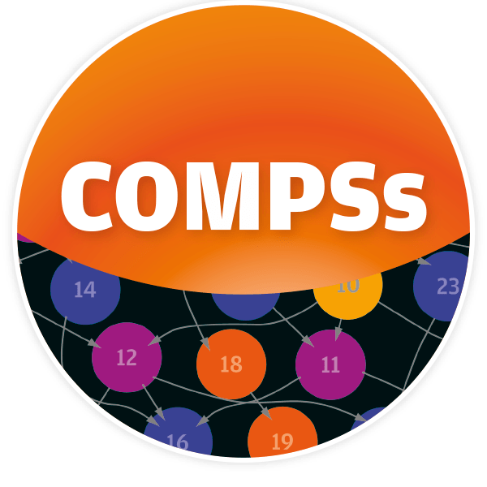

<!--
   Copyright 2019-2022 RO-Crate contributors
   <https://github.com/ResearchObject/ro-crate/graphs/contributors>

   Licensed under the Apache License, Version 2.0 (the "License");
   you may not use this file except in compliance with the License.
   You may obtain a copy of the License at

       http://www.apache.org/licenses/LICENSE-2.0

   Unless required by applicable law or agreed to in writing, software
   distributed under the License is distributed on an "AS IS" BASIS,
   WITHOUT WARRANTIES OR CONDITIONS OF ANY KIND, either express or implied.
   See the License for the specific language governing permissions and
   limitations under the License.
-->

# COMPSs

COMP Superscalar ([COMPSs](https://compss.bsc.es/)) is a task-based programming model which aims to ease the development of applications for distributed infrastructures, such as large High-Performance Clusters (HPC), Clouds and Container managed clusters. PyCOMPSs is the Python binding of COMPSs.

COMPSs provides a programming interface for the development of the applications in Python/Java/C/C++, a runtime system that exploits the inherent parallelism of applications at execution time, and a rich ecosystem for the operation monitoring, performance evaluation and integration with Jupyter/Jupyterlab.

The COMPSs runtime includes the capacity of automatically recording details of the application’s execution as metadata, also known as [Workflow Provenance](https://compss-doc.readthedocs.io/en/stable/Sections/05_Tools/04_Workflow_Provenance.html). The metadata is recorded in RO-Crate format, following [Workflow RO-Crate](https://w3id.org/workflowhub/workflow-ro-crate/1.0) and [Workflow Run Crate](https://w3id.org/ro/wfrun/workflow/0.4) profiles. With workflow provenance, you are able to share not only your workflow application (i.e. the source code) but also your workflow run (i.e. the datasets used as inputs, and the outputs generated as results). 

Provenance information can be useful for a number of things, including Governance, Reproducibility, Replicability, Traceability, or Knowledge Extraction, among others. In our case, we have initially targeted workflow provenance recording to enable users to publish research results obtained with COMPSs as artifacts that can be cited in scientific publications with their corresponding DOI, by using [WorkflowHub](https://workflowhub.eu/).

## Examples of COMPSs RO-Crates

Plenty of examples of COMPSs Workflows with enabled provenance recording can be found at [WorkflowHub](https://workflowhub.eu/workflows?filter%5Bworkflow_type%5D=pycompss) (filtering the browsing by 'COMPSs' workflow type).

In addition, the COMPSs User Manual has a dedicated section on [how to generate Workflow Provenance with COMPSs](https://compss-doc.readthedocs.io/en/stable/Sections/05_Tools/04_Workflow_Provenance.html).

## Resources

* [COMPSs Homepage](https://compss.bsc.es/)
* [COMPSs documentation](https://compss-doc.readthedocs.io/en/stable/)
* [Workflow Provenance Slides Quick Overview](https://zenodo.org/records/11057731)
* [Workflow Provenance Detailed Slides](https://zenodo.org/records/10046567)

## Publications

Raül Sirvent, Javier Conejero, Francesc Lordan, Jorge Ejarque, Laura Rodríguez-Navas, José M Fernández, Salvador Capella-Gutiérrez, Rosa M Badia (2022):  
**Automatic, Efficient and Scalable Provenance Registration for FAIR HPC Workflows**.  
_IEEE/ACM Workshop on Workflows in Support of Large-Scale Science (WORKS)_ (1-9)
<https://doi.org/10.1109/WORKS56498.2022.00006>  
[[preprint](https://upcommons.upc.edu/handle/2117/384589)]

Leo, S., Crusoe, M. R., Rodríguez-Navas, L., Sirvent, R., Kanitz, A., De Geest, P., ... & Soiland-Reyes, S. (2023):
** Recording provenance of workflow runs with RO-Crate**.
_arXiv preprint arXiv:2312.07852._
<https://doi.org/10.48550/arXiv.2312.07852>  

