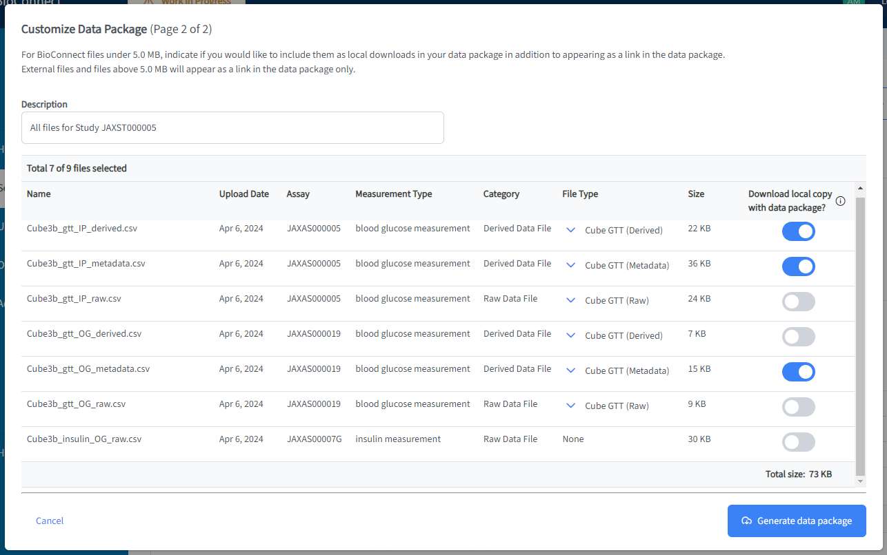

<!--
   Copyright 2019-2022 RO-Crate contributors
   <https://github.com/ResearchObject/ro-crate/graphs/contributors>

   Licensed under the Apache License, Version 2.0 (the "License");
   you may not use this file except in compliance with the License.
   You may obtain a copy of the License at

       http://www.apache.org/licenses/LICENSE-2.0

   Unless required by applicable law or agreed to in writing, software
   distributed under the License is distributed on an "AS IS" BASIS,
   WITHOUT WARRANTIES OR CONDITIONS OF ANY KIND, either express or implied.
   See the License for the specific language governing permissions and
   limitations under the License.
-->

# BioConnect (The Jackson Laboratory)
[](https://docs.bioconnect.jax.org/)

JAX BioConnect provides a digital index for internal researchers, connecting assay results to well-curated metadata. Study metadata are collected and stored in accordance with the [ISA](https://isa-specs.readthedocs.io/en/latest/isamodel.html) format. BioConnect provides a rich UI for data curation and search, and data files are packaged in RO-Crate format for download.


## RO-Crate in BioConnect

Researchers interested in specific data sets in BioConnect can create data packages from one or more studies or assays. The data packages are exported in RO-Crate format, which includes the study metadata and data files. The RO-Crate is available for download and can be used for further analysis or sharing with collaborators.


In addition to the standard RO Crate metadata file, BioConnect RO-Crate packages contain a custom HTML preview file that provides a user-friendly view of the data package contents. The preview file includes links to the data files and to the ISA context entities within BioConnect. If any of the included files has a file type defintion, these are packaged as well. 

> BioConnect's file type definitions are based upon the [Frictionless](https://specs.frictionlessdata.io//table-schema/) table schema format.

To create a data package, a BioConnect user selects a study or set of assays. They are presented with an interface that allows them to customize the package contents, with options to include/exclude specific files, and/or download the source files.



Because BioConnect uses the ISA format for study metadata, the RO-Crate metadata file references ISA schema models as context entities. To support linked data mapping to ISA vocabularies, BioConnect uses an additional [ISA context file](https://github.com/TheJacksonLaboratory/ro-crate-isa-context).


Example:

```
{
    "@context": [
        "https://w3id.org/ro/crate/1.1/context",
        "https://raw.githubusercontent.com/TheJacksonLaboratory/ro-crate-isa-context/init/isa/isa_context_1_0.json"
    ],
    "@graph": [
        {
            "@id": "https://bioconnect-ui-sqa.azurewebsites.net/search/metadata-search-browse/detail-view/investigation/269",
            "@type": "Investigation",
            "name": "JAXIN00000B",
            "title": "Transcriptome profiling of non-islet metabolic tissues in DO founder mice fed high-fat, high-sugar diet. "
        },
        {
            "@id": "https://bioconnect-ui-sqa.azurewebsites.net/search/metadata-search-browse/detail-view/study/444",
            "@type": "Study",
            "investigation": {
                "@id": "https://bioconnect-ui-sqa.azurewebsites.net/search/metadata-search-browse/detail-view/investigation/269"
            },
            "name": "JAXST00000J",
            "publicReleaseDate": "2024-01-21T13:53:08+00:00",
            "submissionDate": "2024-03-26T14:54:09+00:00",
            "title": "RNA-seq expression analysis of liver, adipose, and pancreatic islets from DO founder strain mice."
        }
    ]
}
```
