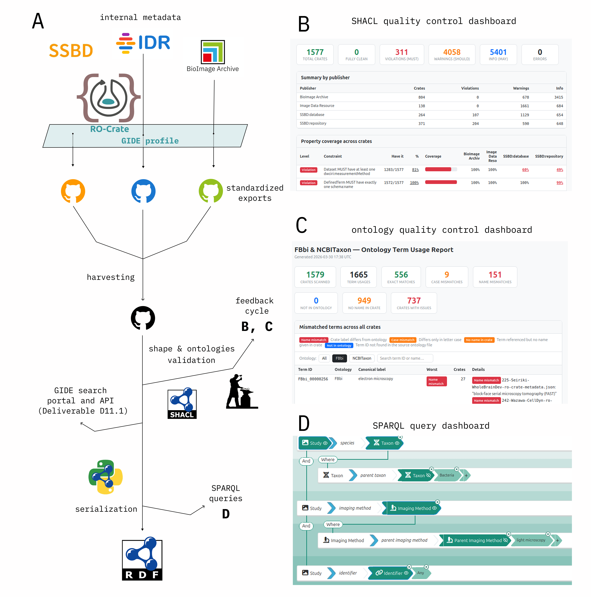

<!--
   Copyright 2019-2022 RO-Crate contributors
   <https://github.com/ResearchObject/ro-crate/graphs/contributors>

   Licensed under the Apache License, Version 2.0 (the "License");
   you may not use this file except in compliance with the License.
   You may obtain a copy of the License at

       http://www.apache.org/licenses/LICENSE-2.0

   Unless required by applicable law or agreed to in writing, software
   distributed under the License is distributed on an "AS IS" BASIS,
   WITHOUT WARRANTIES OR CONDITIONS OF ANY KIND, either express or implied.
   See the License for the specific language governing permissions and
   limitations under the License.
-->

# Global Image Data Ecosystem

<a href="https://founding-gide.eurobioimaging.eu/">

</a>


[What GIDE is]

[How detached RO-Crates are being used in GIDE]


[]

## The GIDE RO-Crate Profile

[Overview of the RO-Crate profile]

[]


[Background of metadata work]


[Context]

```

```


[Example dettached RO-Crate]
```

```
## Resources

* GIDE RO-Crate profile https://www.gide-project.org/ro-crate/search/1.0/profile
* GIDE RO-Crate context https://www.gide-project.org/ro-crate/search/1.0/context
* foundingGIDE Data Deliverable (including RO-Crates and a RDF collection in Turtle format):
https://github.com/German-BioImaging/gide-data-deliverable/


We are using the RO-Crate structure to harmonize metadata for https://www.gide-project.org/portal
