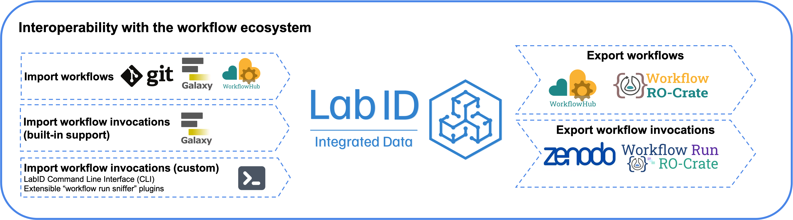

# Lab Integrated Data (LabID)

LabID is an all-in-one FAIR data management platform for life sciences institutes, developed at the EMBL Heidelberg ([MODIS](https://www.embl.org/groups/modis/)).  
It allows keeping track of datasets, samples, and inventory, while featuring an Electronic Lab Notebook.  

The workflow integration of LabID also facilitates collaborative workflow development and versioning, as well as keeping track of workflow executions.
Workflows and workflow runs can be imported and exported from various sources including Galaxy, WorkflowHub and Git repositories.  

LabID takes advantage of the [Workflow RO-Crate](https://about.workflowhub.eu/Workflow-RO-Crate/) and [Workflow Run RO-Crate profiles](https://www.researchobject.org/workflow-run-crate/profiles/) to import workflows from [WorkflowHub](https://workflowhub.eu/), and export workflows and workflow runs to other platforms.

## Resources
* Open-source repositories for the LabID project are [hosted on GitLab](https://gitlab.com/lab-integrated-data).  
* The documentation is available at <https://grp-gbcs.embl-community.io/labid-user-docs/>.

## Funding
This work was supported through the Open Science Clusters’ Action for Research and Society ([OSCARS](https://oscars-project.eu)) European project under grant agreement Nº101129751.  
See [LabID PROV](https://oscars-project.eu/projects/labid-prov-tracking-and-sharing-data-provenance-ro-crate-lab-integrated-data). 
