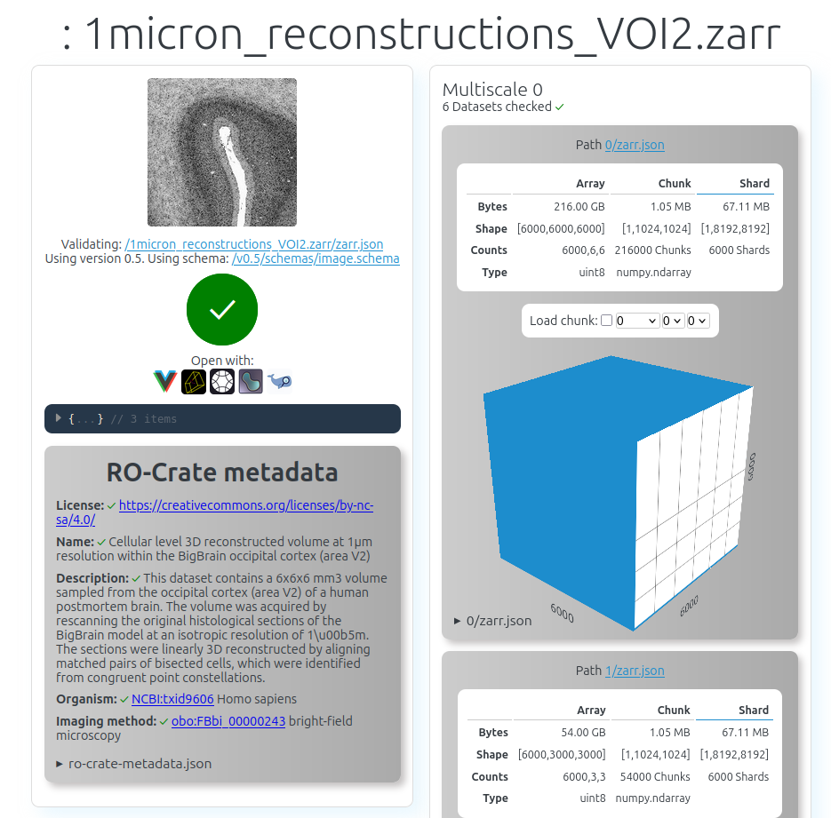

<!--
   Copyright 2019-2022 RO-Crate contributors
   <https://github.com/ResearchObject/ro-crate/graphs/contributors>

   Licensed under the Apache License, Version 2.0 (the "License");
   you may not use this file except in compliance with the License.
   You may obtain a copy of the License at

       http://www.apache.org/licenses/LICENSE-2.0

   Unless required by applicable law or agreed to in writing, software
   distributed under the License is distributed on an "AS IS" BASIS,
   WITHOUT WARRANTIES OR CONDITIONS OF ANY KIND, either express or implied.
   See the License for the specific language governing permissions and
   limitations under the License.
-->

# Open Microscopy Environment

<a href="https://www.openmicroscopy.org/">

</a>


The [Open Microscopy Environment](https://www.openmicroscopy.org/) (OME) is a consortium producing open-source software and format standards for microscopy data since 2005. 

OME core [developer teams](https://www.openmicroscopy.org/teams/) at the University of Dundee and German BioImaging e.V., alongside an active community work on multiple parts of the microscopy data ecosystem. The parts include the [OME Model](https://ome-model.readthedocs.io/en/stable/), a metadata specification for microscopy data, [OMERO](https://www.openmicroscopy.org/omero/), a system to host and share images, and [Bioformats](https://www.openmicroscopy.org/bio-formats/), a package to convert multiple proprietary microscopy formats into a common, interoperable format. More recently, the OME team has been working on a new data standard for n-dimensional arrays called Zarr and its specification for use in microscopy, [OME-Zarr](https://ngff.openmicroscopy.org/). The OME team is using RO-Crate to pack metadata both in the system for transfering data between OMERO servers, as well as for producing self-documenting data in OME-Zarr. 

For example, the [OME CLI Transfer](https://github.com/ome/omero-cli-transfer) plugin allows optionally the packaging of metadata in a RO-Crate-compliant format. A `--rocrate` tag creates a package with flat structure where all image files are saved in a single folder alongsied a JSON metadata file with basic information about the files (name, mimetype).

In 2024, OME also hosted a challenge to make 1 TB of data complying with the [OME-Zarr 0.5 specification](https://ngff.openmicroscopy.org/0.5/). RO-Crate was used to ensure consistent basic metadata for the images, and the tooling included 
commands such as: 

```
ome2024-ngff-challenge resave --cc-by input.zarr output.zarr --rocrate-organism=NCBI:txid9606      # Human
ome2024-ngff-challenge resave --cc-by input.zarr output.zarr --rocrate-modality=obo:FBbi_00000369  # SPIM
ome2024-ngff-challenge resave --cc-by input.zarr output.zarr --rocrate-name="short name of dataset"
ome2024-ngff-challenge resave --cc-by input.zarr output.zarr --rocrate-description="and a longer description"
```

## RO-Crate in the OME 2024 NGFF Challenge

The data produced in the context of the [OME 2024 NGFF Challenge](https://github.com/ome/ome2024-ngff-challenge/) was required to host a top-level `ro-crate-metadata.json` file with metadata containing minimally terms for the specimen ([NCBI taxon identifiers](https://www.ncbi.nlm.nih.gov/taxonomy)) and imaging modality ([Biological Imaging Methods Ontology](https://bioportal.bioontology.org/ontologies/FBbi) terms). 

Here is one example of RO-Crate compliant JSON file generated:

```
{
  "@context": [
    "https://w3id.org/ro/crate/1.1/context",
    {
      "organism_classification": "https://schema.org/taxonomicRange",
      "BioChemEntity": "https://schema.org/BioChemEntity",
      "channel": "https://www.openmicroscopy.org/Schemas/Documentation/Generated/OME-2016-06/ome_xsd.html#Channel",
      "obo": "http://purl.obolibrary.org/obo/",
      "FBcv": "http://ontobee.org/ontology/FBcv/",
      "acquisiton_method": {
        "@reverse": "https://schema.org/result",
        "@type": "@id"
      },
      "biological_entity": "https://schema.org/about",
      "biosample": "http://purl.obolibrary.org/obo/OBI_0002648",
      "preparation_method": "https://www.wikidata.org/wiki/Property:P1537",
      "specimen": "http://purl.obolibrary.org/obo/HSO_0000308"
    }
  ],
  "@graph": [
    {
      "@id": "./",
      "@type": "Dataset",
      "name": "141-Sato-CellMorphology/Fig3a_FIB-SEM_synapse",
      "description": "Single FIB-SEM images of spine synapse in wild-type (C57BL/6J) mice",
      "license": "https://creativecommons.org/licenses/by/4.0/",
      "resultOf": {
        "@id": "#368f5e92-93c4-43b6-a795-00f366656519"
      }
    },
    {
      "@id": "ro-crate-metadata.json",
      "@type": "CreativeWork",
      "conformsTo": {
        "@id": "https://w3id.org/ro/crate/1.1"
      },
      "about": {
        "@id": "./"
      }
    },
    {
      "@id": "#69975ec2-823d-49e9-b26b-be89277682fe",
      "@type": "biosample",
      "organism_classification": {
        "@id": "NCBI:txid10090"
      }
    },
    {
      "@id": "#2aab67cb-7ccb-441e-aa80-445d04547580",
      "@type": "specimen",
      "biosample": {
        "@id": "#69975ec2-823d-49e9-b26b-be89277682fe"
      }
    },
    {
      "@id": "#368f5e92-93c4-43b6-a795-00f366656519",
      "@type": "image_acquisition",
      "fbbi_id": {
        "@id": "obo:FBbi_00050000"
      },
      "specimen": {
        "@id": "#2aab67cb-7ccb-441e-aa80-445d04547580"
      }
    }
  ]
}

```

Of note, while the `ro-crate-metadata.json` file is not part of the OME-Zarr v.0.5 specification, the [NGFF validator tool](https://ome.github.io/ome-ngff-validator/?source=https://dmss3gw.riken.jp/ssbd/zarr/v0.5/2b9f8ab8-5e53-434e-bb08-89e54c232ad8.zarr) detects and validates RO-Crate metadata, demonstrating the compatibility of Zarr objects with RO-Crate. 

[](https://ome.github.io/ome-ngff-validator/?source=https://radosgw.public.os.wwu.de/n4bi-fzj/ome2024-ngff-challenge/1micron_reconstructions_VOI2.zarr)

## Resources

* [OME NGFF Validator](https://ome.github.io/ome-ngff-validator/?source=https://dmss3gw.riken.jp/ssbd/zarr/v0.5/2b9f8ab8-5e53-434e-bb08-89e54c232ad8.zarr), which validates OME-Zarr v.0.5 files containing `ro-crate-metadata.json`
* [OMERO CLI Transfer](https://github.com/ome/omero-cli-transfer), which allows export of OMERO image data compliant with  RO-Crate 
* [OME 2024 NGFF Challenge](https://ome.github.io/ome2024-ngff-challenge/), containing 422.89 TB of public bioimage data including RO-Crate-compliant metadata
