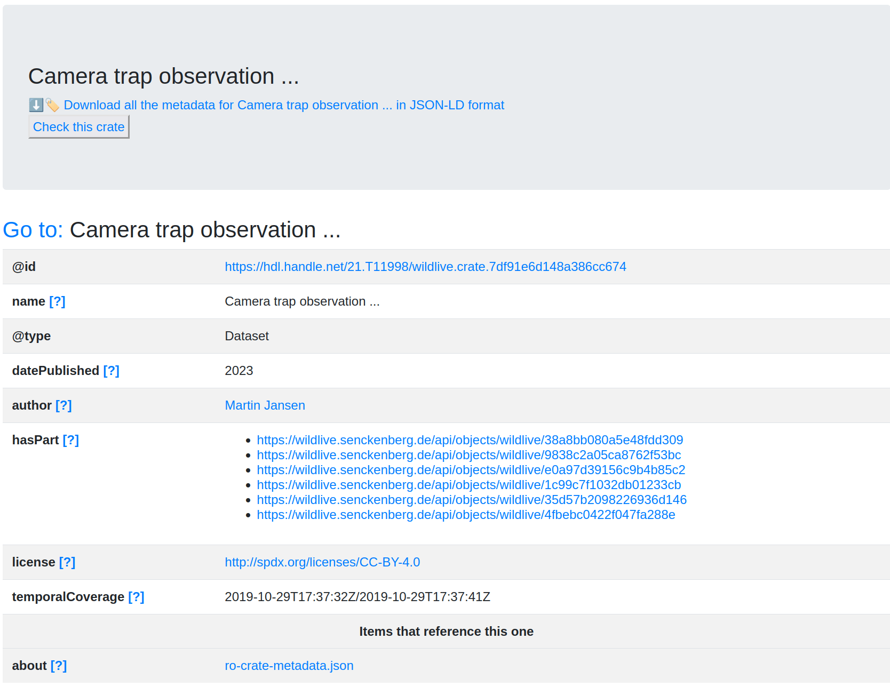

# Senckenberg Wildlive data portal

Senckenberg's [Wildlive data portal](https://wildlive.senckenberg.de/), is a repository and analysis platform for biodiversity monitoring. 

Using [FAIR Signposting](https://signposting.org/FAIR/), the images from cameras monitoring wildlife are also navigatable as FAIR Digital Objects using RO-Crate to expose the  metadata. 

The portal uses [detached RO-Crate](https://www.researchobject.org/ro-crate/1.2-DRAFT/structure.html#detached-ro-crate) as the images are served over separate API calls for seaprate digital objects. At the same time, the use of Handles for persistent identifiers have been explored, as a demonstrator of a hybrid Web/Handle FDO based on the .

_Screenshot of Wildlive with Signposting navigation to RO-Crate from a [capture event](https://wildlive.senckenberg.de/captureevent/wildlive/7df91e6d148a386cc674) (using [signposting-chrome-extension](https://github.com/SandyRogers/signposting-chrome-extension))_

_HTML preview of Wildlive RO-Crate (from [the event's crate](https://wildlive.senckenberg.de/api/call?objectId=wildlive/7df91e6d148a386cc674&method=getAsROCrate))_ 

## Resources

* Slides: <https://slides.com/soilandreyes/2023-11-13-bh2023-fdo#/3>
* Biohackathon preprint: <https://github.com/ResearchObject/bh2023-enabling-fair-digital-objects/blob/main/paper/paper.md>
* Example handle: <https://hdl.handle.net/21.T11998/wildlive.7df91e6d148a386cc674>
* Example detached RO-Crate: <https://wildlive.senckenberg.de/api/call?objectId=wildlive/7df91e6d148a386cc674&method=getAsROCrate>
